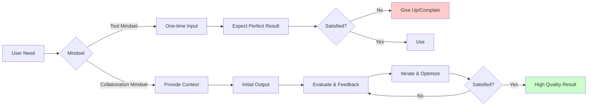
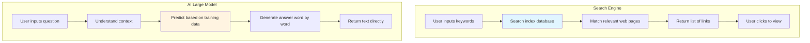
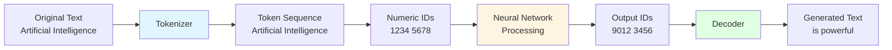
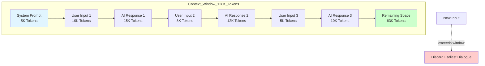
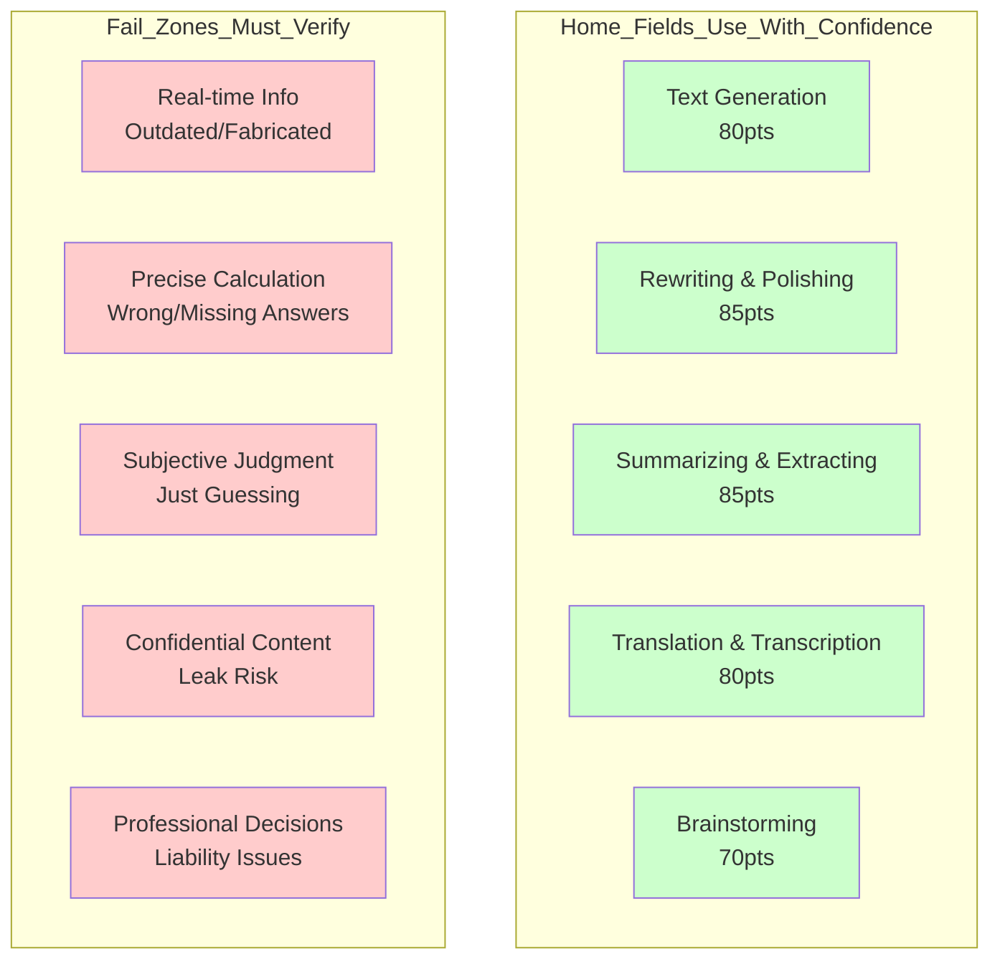
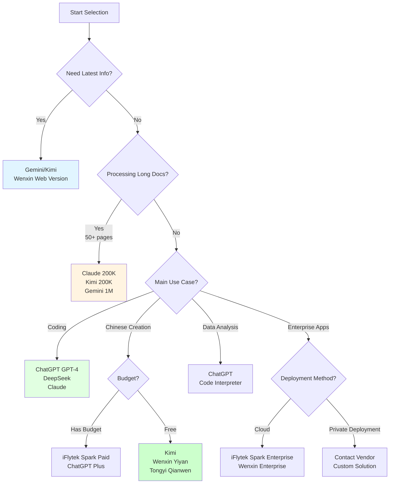
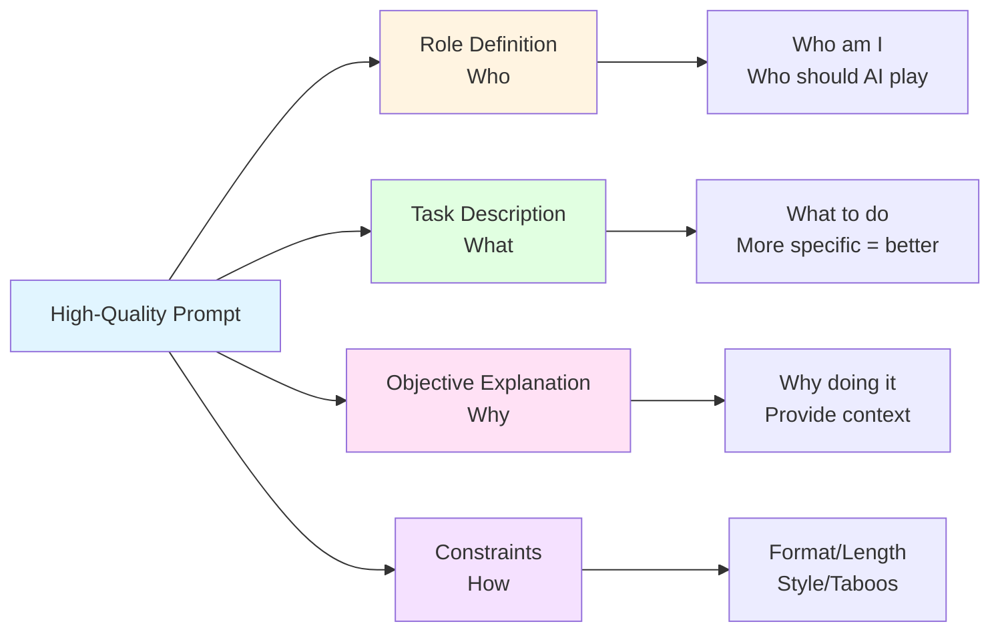

# Lesson 0: AI Cognitive Restructuring - From Tool to Collaborator

> **Course Duration**: 2 hours | **Difficulty**: Introductory | **Style**: Technical Depth + Practical Handbook

---

## Lesson Overview

```
+---------------------------------------------------------------------+
|  Core Insight: AI is not a search engine, but a collaborator        |
|                requiring iterative dialogue                         |
+---------------------------------------------------------------------+
|  What You Will Learn:                                               |
|    • Break down 3 common misconceptions about AI                    |
|    • Understand the essence of large models (Token, context        |
|      window, training data)                                         |
|    • Master AI's capability boundaries and failure modes            |
|    • Build a decision framework for mainstream domestic and        |
|      international products                                         |
|    • Complete your first high-quality AI conversation               |
+---------------------------------------------------------------------+
|  What You Will Take Away:                                           |
|    • An "AI Tool Selection Comparison Chart" (print and post at    |
|      your desk)                                                     |
|    • A "First Conversation Record Template" (5 fields to fill in)  |
|    • A "3 Misconceptions Troubleshooting Checklist" (check each   |
|      item when things go wrong)                                     |
|    • A "Large Model Capability Boundary Map" (what AI can and      |
|      cannot do at a glance)                                         |
|    • A complete hands-on record of "completing a real task with   |
|      AI"                                                            |
+---------------------------------------------------------------------+
```

**This Lesson's Promise:**
- Learn today, use at work tomorrow
- No algorithms, no math, no neural network internals
- Every Section includes "Step-by-step Operations" + "Copy-and-Use Templates" + "Quick Diagnosis Tables"
- Lecture time no more than 50%, the rest is hands-on practice

---

## Opening Hook (10 minutes)

Hello everyone, welcome to Lesson 0 of the AI Literacy Bootcamp.

Let me start with two real stories.

**Story 1: Two Product Managers' PRDs**

Last month, two product managers at our company were assigned the same task: write a PRD for a new feature. Both decided to use AI assistance.

Product Manager A opened ChatGPT and typed: "Help me write a PRD for a user management system." Two hours later, she got an 8-page document that looked professional - with background, objectives, and feature list. But when she presented it to the development team for review, the technical lead asked 3 questions that stumped her: "Is this system for internal or external use?" "What's the expected user scale?" "What granularity should the permission system achieve?" She couldn't answer any of them, because AI gave her a "universal template" that could fit any scenario but wasn't deep enough for any specific one.

Product Manager B also used ChatGPT, but his first message was: "I'm a product manager at a 50-person SaaS company. We need to build an internal employee management system. Currently, we use Excel to manage 50 employees' information, which is very messy. We often have issues with unclear permissions and delayed information updates. I need you to help me design a solution." AI asked him 5 clarifying questions. After he answered, AI provided a targeted solution. 15 minutes later, he followed up: "For a 50-person scale, which features are P0 must-haves and which can be in phase 2?" In the end, he spent 30 minutes getting a PRD ready for development, with only 2 minor revision suggestions from the development team.

**What's the difference?**

It's not about AI - it's about **how AI is used**. Product Manager A treated AI as an "auto-generator," throwing a requirement and waiting for results. Product Manager B treated AI as a "collaborator," gradually clarifying requirements and iterating on solutions through dialogue.

This is the core problem this lesson will solve: **How to build the correct AI cognition, upgrading from "using a tool" to "collaborator mode"**.

**Mindset Comparison:**

| Tool Mindset | Collaboration Mindset |
|--------------|----------------------|
| I press a button, it gives results | I provide tasks, context, feedback |
| Poor output = Tool's fault | Poor output = Whose problem is it? |
| One-time question | Iterative dialogue |
| Expect perfect answers | Expect iterable drafts |

This one word difference determines your career ceiling for the next 3 years.

**Mindset Comparison Diagram:**



In the next 2 hours, I'll guide you through:
- What AI really is, and why it's sometimes smart and sometimes dumb
- What it can and cannot do, where the boundaries lie
- What mainstream products exist domestically and internationally, and how to choose
- How to have your first high-quality conversation

Ready? Let's begin!

---

## Section 1: Three Common Misconceptions (20 minutes)

Let's start by debunking the three most common misconceptions. These misconceptions are the root cause of most people's inability to use AI effectively.

Whether you've used AI or not, you have some "default assumptions" in your mind. 80% of these assumptions are wrong. We need to tear them down before building new cognition.

I'll break down each one using 3 scenarios. Each scenario has "Don't Do This" and "Do This Instead" comparisons.

### 1.1 Misconception 1: AI is Omnipotent

**Typical Manifestations:**
"AI can write code, so it can definitely help with data analysis"
"AI can create art, so making a PPT should be no problem"
"I heard AI can pass the bar exam, so legal consulting should be accurate"

**The Truth: Capability Boundaries Are Very Clear**

Let me show you a real case. In May 2023, American attorney Steven Schwartz submitted a court filing that cited 6 legal precedents to support his argument. During review, the judge discovered - all 6 precedents were fake, with fabricated case numbers, parties, and judgment contents.

The attorney admitted these precedents came from ChatGPT. He thought AI could retrieve precedents like a legal database, but in reality, AI "generated" content that looked like real precedents. He was ultimately fined $5,000 and faced disciplinary action.

**Why does this happen?**

Because AI is essentially a **language predictor**, not a knowledge base. It excels at "predicting the next word based on context," not "retrieving accurate information." When you ask a question, it generates an answer that "sounds reasonable" but doesn't guarantee factual accuracy.

**Don't Do This:**
- Throw "specific goals (10% conversion)" directly at AI
- Expect AI to know your product, users, channels, budget
- Take results without verification and use directly

**Do This Instead:**

**Step-by-Step Operations (3 Steps):**

1. **Step 1: Break Down the Problem**. Split "run an event" into 4 smaller tasks: "User Profile," "Core Selling Points," "Channels," "Conversion Funnel."
2. **Step 2: Provide Context**. Before each small task, tell AI: what the product is, who the users are, what's been done before, what the data looks like.
3. **Step 3: Ask for Suggestions, Not Conclusions**. Ask AI "Give me 3 approaches, their pros and cons, and how to validate each," not "Give me one solution."

**Quick Diagnosis Table:**

| How You Ask AI | Symptom | Prescription |
|----------------|---------|--------------|
| "Help me do X" | Gets universal templates, clichés | Add context, constraints, acceptance criteria |
| "Give me the best solution" | AI makes up something grandiose | Change to "Give 3 solutions + applicable scenarios for each" |
| No project/company/user info provided | Output is hollow, low usability | Add 3 sentences: Who am I, Where am I, What do I want to do |

**What AI Is Truly Good At:**
- Text generation, rewriting, polishing
- Brainstorming, creative ideation
- Summarizing, extracting, translating
- Explaining concepts, making analogies
- Code generation (but needs verification)

**What AI Is Not Good At:**
- Real-time information (stock prices, today's weather)
- Precise calculations (complex math, financial accounting)
- Subjective judgments (legal consulting, medical diagnosis)
- Confidential content (internal company data, undisclosed information)

**Key Takeaway:**
AI is not omnipotent; it has clear capability boundaries. Before using AI, ask yourself: Is this task "generative/creative" or "precise query"? The former suits AI; be cautious with the latter.

### 1.2 Misconception 2: AI is a Search Engine

**Typical Manifestations:**
"Check today's Apple stock price for me"
"Who won the 2024 Nobel Prize in Literature?"
"What were our company's Q4 sales last year?"

**The Truth: AI is a Language Predictor, Not a Search Engine**

Let me give you a comparison:

**How Search Engines Work:**
1. You input keywords
2. It searches its index for matching web pages
3. Returns a list of links
4. You click links to view original information

**How Large Models Work:**
1. You input a question
2. It **predicts** a reasonable answer based on patterns in training data
3. Directly generates text
4. Doesn't provide information sources (unless it's a web-connected version)

**Key Difference: Generation vs. Retrieval**

Let me give you an example. Suppose you ask: "How to read a CSV file in Python?"

A search engine would give you:
- Discussion links on Stack Overflow
- Python official documentation links
- Various tutorial blog links

AI would directly give you:
```python
import pandas as pd

# Read CSV file
df = pd.read_csv('data.csv')

# Display first 5 rows
print(df.head())
```

Seems more convenient, right? But here's the problem - **if this knowledge is wrong or outdated in AI's training data, it will confidently give you a wrong answer**.

**Don't Do This:**
- Ask AI about current events, latest policies, real-time prices
- Take AI's numbers/citations/names/dates directly as facts
- Ask "how are things recently" type questions that depend on timeliness

**Do This Instead:**

**Decision Tree (Text Version):**

```
Information you're looking for ->
├─ Is it "latest"? (today, this month, real-time)
│   ├─ Yes -> Use web search / Perplexity / AI with web access
│   └─ No -> Continue judging
├─ Is it "specific numbers/citations/laws"?
│   ├─ Yes -> Must verify from official/authoritative sources
│   └─ No -> Can let AI answer directly
└─ Is it "opinions/ideas/writing/summarization"?
    └─ Yes -> AI's strength, use directly
```

**Bad Prompt vs. Good Prompt:**

**Bad Prompt:**
"What's the weather in Beijing on May 6, 2026?"
-> AI will make up an answer because its training data cutoff might be 2025, so it doesn't know today's weather.

**Good Prompt:**
"I want to write an article about how weather affects mood. Help me generate psychological descriptions for 3 different weather scenarios."
-> This is a generative/creative task, which AI excels at.

**Bad Prompt:**
"What were our company's sales last month?"
-> AI can't possibly know your company's internal data.

**Good Prompt:**
"I have a sales data spreadsheet (uploaded). Help me summarize last month's sales trends and identify the Top 3 products and fastest-growing regions."
-> You provide data, AI does analysis.

**Copy-and-Use Template Card:**

```
[Factual Verification Three Questions]
When asking AI for any specific numbers, names, citations, laws, dates, always ask:
1. What's the source? Can you give me a link?
2. If uncertain, please mark "unverified."
3. Give me 2 authoritative sources for cross-verification.
```

**Deep Insight: Mechanism Analysis**

Why isn't AI a search engine? Because its working principle is completely different:

1. **Training Phase** (completed, you can't change it):
   - AI read massive amounts of text (books, web pages, code, etc.)
   - Learned statistical patterns of language: "what word typically follows what word"
   - Formed a giant "probability model"

2. **Inference Phase** (when you use it):
   - You input a question
   - AI predicts the answer word by word based on its probability model
   - Each word choice is "which word has the highest probability in the current context"

So AI is essentially **continuing text**, not **querying**. The content it generates "sounds like what a human would say," but doesn't guarantee factual accuracy.

**AI Working Principle Comparison Diagram:**



**Key Takeaway:**
AI is not a search engine; it's a language predictor. Don't ask it "query-type" questions; give it "generative" tasks. When you need accurate information, either use a search engine or use a web-connected AI and verify sources.

### 1.3 Misconception 3: AI Can Give Perfect Answers in One Go

**Typical Manifestations:**
"Help me write a weekly report" -> Gets result -> "That's it?" -> Give up using it

**The Truth: Iterative Dialogue Is the Way**

Let me show you two real conversation records.

**Conversation A (One-time Question, Failed Case):**

```
User: Help me write an apology letter to a client.

AI: Dear Client,
Hello! We sincerely apologize for the inconvenience. We have noted the issue and are actively addressing it.
Thank you for your understanding and support.
Sincerely,
[Signature]

User thinks: This is too perfunctory... forget it, I'll write it myself.
```

**Conversation B (Multi-round Iteration, Successful Case):**

```
User: I need to write an apology letter to a client. The background is: we promised a custom report in 3 days, but due to data source issues, it was delayed by 2 days. The client is very unhappy.

AI: Understood. May I ask:
1. Is this client a new or existing client?
2. What specific impact did the delay have on the client?
3. What compensation plan are you prepared to offer?

User: Existing client, working together for 2 years. They needed this report for a board meeting, now they have to postpone the meeting. We're offering free report service for next month.

AI: [Generates a 300-word apology letter including:
- Appreciation for the long-term client
- Specific explanation of the delay and reasons
- Understanding of the client's loss
- Compensation plan
- Improvement measures]

User: Good, but can the tone be more sincere? It feels a bit formal now.

AI: [Adjusted version with more sincere tone, adding phrases like "I personally deeply apologize"]

User: Perfect, let's use this!
```

**Comparison Analysis:**

| Dimension | Conversation A | Conversation B |
|-----------|----------------|----------------|
| Context Provided | Almost none | Detailed background info |
| Dialogue Rounds | 1 round | 4 rounds |
| AI's Understanding | Only knows "apology letter" | Knows client relationship, impact, compensation |
| Output Quality | Generic template | Customized solution |
| User Satisfaction | Abandoned | Adopted |

**Don't Do This:**
- See first version unsatisfactory, close window and say "AI doesn't work"
- Start new conversation, ask again, expect different result
- Complain about AI internally, then write from scratch yourself

**Do This Instead:**

**Step-by-Step Operations (Iteration 4 Moves):**

1. **Move 1: Be More Specific**. "Too general, rewrite for an internet company with 30-50 employees."
2. **Move 2: Add Constraints**. "Budget no more than 20K per person per month, must include stock options."
3. **Move 3: Change Perspective**. "From a fresh graduate's perspective, which part lacks appeal?"
4. **Move 4: Request Comparisons**. "Give me an aggressive version and a conservative version, with pros and cons of each."

**Quick Diagnosis Table:**

| Symptom | Which Move to Use | Example Phrase |
|---------|-------------------|----------------|
| Output too generic, sounds like boilerplate | Move 1 | "Too general, rewrite for XX scenario" |
| Output direction right but has fatal flaws | Move 2 | "Can't exceed X, must include Y" |
| You can't decide whether to use it | Move 3 | "Look at this version from boss/user/competitor perspective" |
| Want to make a decision but only have one option | Move 4 | "Give 2 more versions with different strategies" |

**Deep Insight: Why Iteration Is Needed?**

Because AI faces **information asymmetry**:
- You have complete background, objectives, and constraints in your mind
- AI only sees the few words you typed
- Information you think is "obvious," AI knows nothing about

It's like going to a restaurant and only saying "give me a dish." How does the waiter know if you want Sichuan or Cantonese, spicy or not, main dish or snack?

**Good Dialogue Process:**

1. **First Round: Give Enough Context**
   - Who am I (role/background)
   - What do I want to do (task)
   - Why am I doing it (objective)
   - What are the constraints

2. **Second Round: Let AI Ask Questions**
   - "Before giving a solution, what else do you need to know?"
   - AI will ask about key information you hadn't thought of

3. **Third Round: Evaluate Output**
   - What's good, what's not
   - Specific directions for modification

4. **Fourth Round: Fine-tune**
   - Tone, length, format and other details

**Key Takeaway:**
AI isn't a vending machine where you insert coins and get products. It's a collaborator that needs to gradually clarify requirements and iterate solutions through dialogue. Being unsatisfied with the first output is normal; the key is learning to follow up and adjust.

**Section Output**

Now you should be able to:
- See an "AI help me do X" request and immediately judge whether and how to break it down
- For any specific numbers/citations/dates, have the conditioned reflex "should I verify this?"
- When the first version isn't satisfactory, instead of closing the window, use the "Iteration 4 Moves" to continue

**Takeaway Tool**: "3 Misconceptions Troubleshooting Checklist" - check each item when AI goes wrong.

---

## Section 2: What Is a Large Model Really (25 minutes)

Now let's dive into understanding the essence of large models. Only by understanding how they work can you know why they're sometimes smart and sometimes dumb.

This is the only section where "you must understand the principles." Without understanding, you'll never know why AI is inconsistently smart and dumb.

But I won't talk about neural networks, matrices, or gradient descent. I'll use 4 analogies to help you thoroughly understand in 10 minutes.

### 2.1 Best Analogy: The World's Strongest "Word Chain Player"

Let me give you the most intuitive analogy.

Imagine you're playing a "word chain" game:
- I say "artificial," you respond "intelligence"
- I say "today's weather," you respond "is nice"
- I say "Python is a," you respond "programming language"

Why can you respond so naturally? Because you've seen many similar sentences and know what word typically follows what word.

**Large models work exactly this way**, except:
- They've seen tens of thousands more sentences than you (the entire internet's text)
- Their chain rules are tens of thousands more complex than yours (hundreds of billions of parameters)
- They chain tens of thousands faster than you (generating dozens of words per second)

When you ask AI "How does Python read a file?", it doesn't "look up" the answer. Instead, based on countless code examples seen during training, it **predicts** the most likely answer.

**This analogy explains many phenomena:**

1. **Why does AI sometimes "confidently make things up"?**
   - Because it only cares about "chaining smoothly," not "whether the content is true"
   - Just like when playing word chain, you can say "today's weather is terrible" or "today's weather is beautiful" - both are smooth, but only one is fact

2. **Why does giving AI more context lead to better answers?**
   - Because context is "the preceding text for chaining" - the more detailed the preceding text, the more accurate the following text
   - Just like when you hear "in a hospital, a doctor says to a patient," you'll follow with medical-related words; when you hear "in a bar, a friend says to a friend," you'll follow with casual conversation

3. **Why does AI have a "knowledge cutoff date"?**
   - Because its "chaining rules" were learned during training and fixed after training completes
   - Just like knowledge you learned in 2020 is still 2020 knowledge in 2026, unless you continue learning

**Don't Do This**: Think AI is "thinking" about your question.

**Do This Instead**: Treat AI as a "friend who has read 10 million books but has a somewhat messy memory." You need to **guide them to chain in the right direction**.

### 2.2 Token: AI Doesn't See Characters, It Sees Numbers

Now let's discuss the first technical concept: **Token**. This is key to understanding AI costs, limitations, and behavior.

**What is a Token?**

Simply put, a Token is the smallest unit AI uses to process text. But it's not a "character" or a "word" - it's a "language fragment" between the two.

AI doesn't see Chinese characters, words, or sentences. It cuts all text into **"Tokens"** - you can think of them as "building blocks."

**Token Processing Flow:**



Let me show you some examples:

**Chinese:**
- "人工智能" (Artificial Intelligence) -> Might be split into ["人工", "智能"] (2 Tokens)
- "AI" -> 1 Token
- "ChatGPT" -> Might be ["Chat", "G", "PT"] (3 Tokens)
- One Chinese character ≈ 1-1.5 Tokens (average)

**English:**
- "artificial intelligence" -> ["art", "ificial", " intelligence"] (3 Tokens)
- "AI" -> 1 Token
- One English word ≈ 1.3 Tokens (average)

**Why split into Tokens?**

Because computers don't recognize text, only numbers. AI's workflow is:
1. **Tokenization**: Cut text into Tokens
2. **Encoding**: Convert each Token to a numeric ID
3. **Computation**: Process these numbers with a neural network
4. **Decoding**: Convert output numeric IDs back to Tokens, then assemble into text

**Why is this concept important?**

**Reason 1: Cost Calculation**

Almost all AI services charge by Token:
- GPT-4: Input $0.03/1K Tokens, Output $0.06/1K Tokens
- Claude: Input $0.015/1K Tokens, Output $0.075/1K Tokens
- Domestic models: Usually ¥0.001-0.01/1K Tokens

A 1000-character Chinese document ≈ 1500-2000 Tokens.

**Reason 2: Context Window Limitations**

Every model has a "context window" limit, measured in Tokens:
- GPT-4: 128K Tokens (approximately 100K Chinese characters)
- Claude: 200K Tokens (approximately 150K Chinese characters)
- iFlytek Spark: 128K Tokens

Exceed this limit, and AI "can't remember" anymore.

**Reason 3: Chinese vs. English Cost Difference**

The same meaning:
- English: "AI is powerful" -> 4 Tokens
- Chinese: "AI很强大" -> 5-6 Tokens

So conversing with AI in Chinese typically consumes 30-50% more Tokens than English, costing more. This isn't discrimination, it's a technical characteristic - Chinese language structure is more complex with lower splitting efficiency.

**Quick Diagnosis Table:**

| Input Type | Approximate Tokens | Corresponding Chinese Characters |
|------------|-------------------|----------------------------------|
| One WeChat message | 20-50 | 30-80 characters |
| One work email | 200-500 | 300-800 characters |
| One product requirement | 1000-3000 | 1500-5000 characters |
| One 30-page report | 15000-25000 | 20-40K characters |

**Practical Impact:**

Suppose you want AI to summarize a 50-page report:
- 50 pages ≈ 25K characters ≈ 35K Tokens
- Using GPT-4: Input cost = 35 × $0.03 = $1.05
- If AI generates a 2000-character summary ≈ 3000 Tokens: Output cost = 3 × $0.06 = $0.18
- Total cost ≈ $1.23 (about ¥9)

Seems cheap, but if you process 10 reports daily, that's ¥2700 per month. This is why enterprises need to consider cost optimization.

**Key Takeaway:**
Token is AI's "currency unit," determining costs and limitations. Chinese is more "expensive" than English; pay attention to context window for long documents.

### 2.3 Context Window: AI's "Short-term Memory"

**What is a Context Window?**

Context Window is the maximum amount of information AI can "remember" in a single conversation, measured in Tokens.

**Analogy:**

Imagine conversing with someone who has short-term memory impairment:
- They can remember the last 10 minutes of conversation
- Beyond 10 minutes, they forget
- You must say important information within 10 minutes, or repeat what was said before

AI's context window is this "10 minutes."

You can think of "context window" as AI's **work desk** - how big the desk is determines the upper limit of how much it can process at once.

**Context Window Schematic:**



**Context Windows of Mainstream Models:**

| Model | Context Window | Equivalent To | Roughly Equivalent To |
|-------|---------------|---------------|----------------------|
| GPT-4 Turbo | 128K Tokens | 100K Chinese characters, ~300 Word pages | A thin book |
| Claude 3.5 Sonnet | 200K Tokens | 150K Chinese characters, ~500 Word pages | 1-5 books |
| Gemini 1.5 Pro | 1M Tokens | 750K Chinese characters, ~2500 Word pages | Over a dozen books |
| iFlytek Spark | 128K Tokens | 100K Chinese characters | A thin book |
| Wenxin Yiyan | 128K Tokens | 100K Chinese characters | A thin book |
| Kimi | 200K Tokens | 150K Chinese characters | 1-5 books |

**What Does Context Window Include?**

All content in a conversation occupies the context window:
- All your inputs (prompts + uploaded documents)
- All AI's outputs
- System prompts (you don't see them, but they exist)

**Example:**

Suppose you use GPT-4 (128K Token window):
1. You upload a 50-page report (35K Tokens)
2. You ask "Summarize this report" (10 Tokens)
3. AI responds with 2000 characters (3000 Tokens)
4. You follow up "Focus on Chapter 3" (10 Tokens)
5. AI responds with another 1000 characters (1500 Tokens)

Used so far: 35000 + 10 + 3000 + 10 + 1500 = 39520 Tokens

Remaining: 128000 - 39520 = 88480 Tokens, can continue the conversation.

**What Happens When Exceeding the Window?**

Different models handle this differently:
- **Truncation**: Discard earliest dialogue, keep only the most recent (most common)
- **Error**: Directly prompt "Context too long, please shorten input"
- **Summary Compression**: Automatically summarize early dialogue, replace original with summary (Claude's approach)

**Don't Do This:**
- Throw a 100-page PDF to an old model with an 8K window
- Use one conversation window all day, hundreds of rounds without switching
- Re-paste an entire PRD for a small requirement change

**Do This Instead:**

**Step-by-Step Operations (3 Habits):**

1. **Habit 1: Start New Conversation When Switching Tasks**. One window for emails, another for analysis, don't cross-contaminate.
2. **Habit 2: Compress Long Documents Before Feeding**. For a 30-page report, have AI summarize by chapter first, then discuss.
3. **Habit 3: Put Important Instructions at the End**. AI "remembers better" what comes later; put key requirements in the final paragraph.

**Practical Impact:**

**Scenario 1: Long Document Analysis**
- If the document exceeds the context window, must process in segments
- Or choose a model with a larger window (like Gemini 1.5 Pro, Kimi)

**Scenario 2: Long Conversations**
- Too many dialogue rounds, AI will "forget" initial instructions
- Solution: Periodically reiterate key information, or start a new conversation

**Scenario 3: Cost Optimization**
- Longer context means higher cost per call (because all history must be reprocessed)
- Unnecessary long context is wasting money

**Key Takeaway:**
Context window is AI's "short-term memory" limit. When choosing a model, look at window size; when using it, be careful not to stuff too much irrelevant information.

### 2.4 Training Data: Why AI Has a "Knowledge Cutoff Date"

**What is Training Data?**

AI's "knowledge" comes from training data - all the text it read during the training phase. After training completes, this knowledge is fixed unless retrained.

Every large model has a **"knowledge cutoff date"** - what it learned only goes up to that point in time.

**Knowledge Cutoff Dates of Mainstream Models:**

| Model | Knowledge Cutoff Date | Notes |
|-------|----------------------|-------|
| GPT-4 | October 2023 | Doesn't know anything after |
| Claude 3.5 | April 2024 | Doesn't know anything after |
| Gemini | Real-time web access | Can search for latest information |
| iFlytek Spark | June 2024 | Domestic models update faster |
| Wenxin Yiyan | August 2024 | Domestic models update faster |
| Kimi | Real-time web access | Can search for latest information |

**Why Have a Cutoff Date?**

Because training a large model requires:
- Tens of thousands of GPUs
- Millions of dollars in cost
- Weeks to months of time

Impossible to retrain every day, so knowledge becomes "outdated."

**Don't Do This:**
- Ask about news from May 2026
- Ask about new policies released last week
- Ask "what AI is strongest right now"

**Do This Instead:**

**Copy-and-Use Template Card:**

```
[Timeliness Three Questions]
Before asking AI a question, first ask yourself:
1. Will this answer change over time?
   No -> Ask AI directly.
   Yes -> Next question.
2. What's the rate of change?
   Year-level -> AI is okay, but verify.
   Month/week-level -> Must use web-connected version or check official sources.
3. What's the cost if this answer is wrong?
   Small -> Can make do.
   Big (contracts, legal, medical, financial) -> Always verify manually.
```

**Practical Impact:**

**Scenario 1: Current Events**

**Wrong Usage:**
"What major events happened on May 6, 2026?"
-> If the model's cutoff is 2024, it will make up an answer or say "I don't know"

**Correct Usage:**
Use a web-connected model (Gemini, Kimi, Wenxin web version), or use a search engine

**Scenario 2: Technical Documentation**

**Wrong Usage:**
"What are the new features in React 19?" (if the model was trained when React was still 18)
-> AI might make things up, or give React 18 information

**Correct Usage:**
- Use a web-connected model
- Or explicitly tell AI: "Here's React 19's official documentation (paste docs), help me summarize new features"

**Scenario 3: Company Internal Information**

**Wrong Usage:**
"What was our company's strategy last year?"
-> AI can't possibly know your company's internal information

**Correct Usage:**
Upload relevant documents, have AI answer based on documents

**Key Takeaway:**
AI's knowledge has a cutoff date and doesn't know anything after. When you need the latest information, use a web-connected model or actively provide materials.

**Section Output**

Now you should be able to answer:
- Why is AI sometimes smart and sometimes dumb? (It's guessing words, not thinking)
- Why might the same question have different answers today vs. tomorrow? (Model has randomness + version updates)
- Why can't AI answer "what's the weather today"? (No web access + training cutoff date)
- Why do long conversations easily "drift off"? (Context window + memory decay)

**Takeaway Tool**: "Token / Context / Cutoff Date Quick Estimation Table."

---

## Section 3: AI's Capability Boundaries (25 minutes)

Now let's systematically review AI's capability boundaries. Knowing what it can and cannot do helps you use it in the right places.

Section 2 covered "how AI works"; this section covers "what AI can and cannot do." This is the table you need most for **daily decision-making**.

### 3.1 AI's 5 Major "Home Fields" vs. 5 Major "Fail Zones"

**AI Capability Boundary Matrix:**



**Home Fields (Confidently Hand to AI):**

| Capability | Typical Tasks | Quality Expectation |
|------------|---------------|---------------------|
| Text Generation | Writing emails, notices, drafts | 80 points, usable with minor edits |
| Rewriting & Polishing | Making text more professional/casual/concise | 85 points, can use directly |
| Summarizing & Extracting | Compressing 10K characters to 500 | 85 points, high accuracy |
| Translation & Transcription | Chinese-English, formal/casual switching | 80 points, needs proofreading |
| Brainstorming | 20 titles, 10 event ideas | 70 points, sufficient quantity |

**Fail Zones (Don't Hand to AI, or Must Verify):**

| Capability | Typical Fail Scenarios | Consequence |
|------------|------------------------|-------------|
| Real-time Information | Today's stock prices, today's news, this month's policies | Outdated or fabricated |
| Precise Calculation | Complex finance, multi-step math, rigorous statistics | Wrong/missing answers |
| Subjective Judgment | "Which solution is better" (when no evaluation criteria given) | Just guessing |
| Confidential Content | Uploading client lists, raw financial data | Data leak risk |
| Specific Domain Professional Decisions | Legal judgments, medical diagnoses, engineering safety certifications | Liability incidents |

### 3.2 Hallucination - The Failure Mode to Be Most Alert About

**What is Hallucination**: AI generates content that **looks reasonable, sounds professional, but simply doesn't exist**.

**Real Cases:**

- In 2023, an American attorney used ChatGPT to write a legal brief citing 6 precedents - all fabricated by AI. The judge checked and fined $5,000.
- A domestic product manager used AI to write competitor analysis citing "a report shows XX" - upon checking later, that report never existed.
- An operations person wrote a public account article; AI cited "Harvard University 2023 research" - no such research existed.

**Why Hallucination Occurs**: Return to Section 2's analogy - AI is "chaining words," not "verifying facts." It has seen the sentence pattern "A certain university recently had a study showing..." tens of thousands of times, so it naturally chains one that sounds plausible.

**Don't Do This:**
- Believe AI when it speaks confidently, cites specifically, and gives precise numbers
- Directly publish AI-generated content externally
- Trust AI's "citations" in scenarios requiring authority (legal, medical, academic)

**Do This Instead:**

**Step-by-Step Operations (Anti-Hallucination 4-Step Method):**

1. **Step 1: Categorize Text**. In AI's output, which parts are "opinions" (trustworthy) vs. "factual assertions" (need verification).
2. **Step 2: Circle High-Risk Items**. Names, company names, book titles, dates, numbers, laws, citations - mark all in red.
3. **Step 3: Verify One by One**. Check official websites, authoritative sources, Google Scholar.
4. **Step 4: Delete If Uncertain**. Better to have 100 fewer words than one wrong number.

**Copy-and-Use Template Card:**

```
[AI Output Verification Checklist (6 Questions)]
Before publishing any AI-produced external document, go through each:
[ ] 1. Are there specific numbers? -> Check sources
[ ] 2. Are there names/company names? -> Check if they actually exist
[ ] 3. Are there "studies show"/"reports indicate"? -> Find original links
[ ] 4. Are there laws/policy names? -> Verify in official databases
[ ] 5. Is there time-sensitive content? -> Check AI's training cutoff date
[ ] 6. Are there paragraphs that "feel professional but I don't quite understand"? -> Ask professional colleagues
Only publish after checking all boxes.
```

### 3.3 Quick Decision Table: Should This Task Be Handed to AI

```
Your task ->
├─ Need to "create/generate ideas/text/plans"?
│   └─ Yes -> Hand to AI, rely on it for first draft
├─ Need "precise numbers/real-time info/authoritative citations"?
│   └─ Yes -> Don't hand to AI, or only let it "list ideas" while you verify
├─ Involves "confidential data/user privacy/company secrets"?
│   └─ Yes -> Either anonymize before using, or use privately deployed AI, never on public networks
├─ Involves "final legal/medical/major financial decisions"?
│   └─ Yes -> AI only does drafts, professionals finalize
└─ Other -> Use confidently
```

**Section Output**

Now you should be able to:
- See a task and within 3 seconds judge "how far can AI go, what do I need to supplement"
- Understand "hallucination" isn't AI intentionally deceiving you; it's determined by its working mechanism
- Develop the conditioned reflex "always verify specific numbers/citations from AI output"

**Takeaway Tools**: "AI Capability Boundary Map" + "AI Output Verification 6-Question Checklist."

---

## Section 4: Overview of Mainstream Domestic and International AI Products (20 minutes)

Now let's look at what mainstream AI products exist in the market and how to choose what suits you.

### 4.1 International Mainstream Products

**ChatGPT (OpenAI)**

| Dimension | Details |
|-----------|---------|
| Advantages | Most mature ecosystem, most plugins, strong GPT-4 reasoning |
| Disadvantages | Requires special network access in China, expensive paid version ($20/month) |
| Best For | Complex reasoning, code generation, English content creation |
| Context Window | 128K Tokens |
| Knowledge Cutoff | October 2023 |

**Claude (Anthropic)**

| Dimension | Details |
|-----------|---------|
| Advantages | Strong long document processing, stable output quality, good safety |
| Disadvantages | Requires special network access in China, conservative on some creative tasks |
| Best For | Long document analysis, professional writing, code review |
| Context Window | 200K Tokens |
| Knowledge Cutoff | April 2024 |

**Gemini (Google)**

| Dimension | Details |
|-----------|---------|
| Advantages | Real-time web access, strong multimodal capabilities, generous free tier |
| Disadvantages | Requires special network access in China, relatively weaker Chinese |
| Best For | Need for latest information, mixed image-text processing |
| Context Window | 1M Tokens |
| Knowledge Cutoff | Real-time web access |

### 4.2 Domestic Mainstream Products

**iFlytek Spark**

| Dimension | Details |
|-----------|---------|
| Advantages | Strong Chinese capability, accurate voice recognition, many industry versions |
| Disadvantages | Relatively weaker code capability, less creative ideation than international products |
| Best For | Chinese writing, meeting minutes, education scenarios |
| Context Window | 128K Tokens |
| Price | Free + Paid (¥199/month) |

**Wenxin Yiyan (Baidu)**

| Dimension | Details |
|-----------|---------|
| Advantages | Good Chinese understanding, web search, Baidu ecosystem integration |
| Disadvantages | Output sometimes too "formal," average creativity |
| Best For | Information retrieval, Chinese content generation, enterprise applications |
| Context Window | 128K Tokens |
| Price | Free + Paid (¥59.9/month) |

**Kimi (Moonshot AI)**

| Dimension | Details |
|-----------|---------|
| Advantages | Super long context (200K), web search, free |
| Disadvantages | Relatively weaker reasoning, sometimes verbose output |
| Best For | Long document processing, paper reading, information integration |
| Context Window | 200K Tokens |
| Price | Completely free |

**Tongyi Qianwen (Alibaba)**

| Dimension | Details |
|-----------|---------|
| Advantages | Alibaba ecosystem integration, multimodal capabilities, full enterprise features |
| Disadvantages | Personal version features limited, output quality fluctuates |
| Best For | E-commerce scenarios, enterprise applications, image-text generation |
| Context Window | 128K Tokens |
| Price | Free + Enterprise |

**DeepSeek**

| Dimension | Details |
|-----------|---------|
| Advantages | Strong code capability, good reasoning, cheap pricing |
| Disadvantages | Low brand awareness, immature ecosystem |
| Best For | Code generation, technical documentation, logical reasoning |
| Context Window | 128K Tokens |
| Price | Pay-per-use API (extremely low prices) |

### 4.3 Selection Decision Framework

**AI Product Selection Decision Tree:**



**Quick Decision Table:**

```
Your Main Need ->
├─ Need latest info/real-time search?
│   └─ Yes -> Gemini / Kimi / Wenxin Yiyan (web version)
├─ Processing super long documents (50+ pages)?
│   └─ Yes -> Claude / Kimi / Gemini
├─ Mainly writing code?
│   └─ Yes -> ChatGPT (GPT-4) / DeepSeek / Claude
├─ Mainly Chinese content creation?
│   └─ Yes -> iFlytek Spark / Wenxin Yiyan / ChatGPT
├─ Limited budget/want free?
│   └─ Yes -> Kimi / Wenxin Yiyan Free / Tongyi Qianwen
├─ Enterprise apps/need private deployment?
│   └─ Yes -> iFlytek Spark Enterprise / Wenxin Enterprise / Tongyi Enterprise
└─ Pursuing strongest capability/money no object?
    └─ Yes -> ChatGPT Plus (GPT-4) / Claude Pro
```

**Copy-and-Use Template Card:**

```
[Personal Selection 3-Step Method]
Step 1: List your 3 most common tasks
  Example: Write weekly reports, analyze competitors, write code

Step 2: Compare with the product table above, find best choice for each task
  Example: Weekly reports -> iFlytek Spark
       Competitor analysis -> Kimi (long docs)
       Coding -> ChatGPT

Step 3: Choose 1-2 primary products + 1 backup
  Primary: Covers 80% of tasks
  Backup: Handles scenarios primary isn't good at
```

**Section Output**

Now you should be able to:
- Name characteristics of 3-5 mainstream AI products
- Choose the 1-2 most suitable products for your work scenarios
- Know which tool to switch to for which scenario

**Takeaway Tool**: "AI Tool Selection Comparison Chart."

---

## Section 5: First High-Quality Conversation Practice (30 minutes)

We've covered a lot of theory; now let's practice - I'll guide you step-by-step through your first high-quality AI conversation.

### 5.1 Pre-Conversation Preparation Checklist

Before starting a conversation, ask yourself 5 questions:

**Copy-and-Use Template Card:**

```
[Pre-Conversation 5 Questions]
[ ] 1. What do I want AI to help me do? (State the task in one sentence)
[ ] 2. What's my role/background? (Let AI know who you are)
[ ] 3. What are the success criteria? (What kind of output counts as acceptable)
[ ] 4. What are the constraints? (Word count, style, format, taboos)
[ ] 5. What background materials can I provide? (Documents, data, examples)
```

### 5.2 Four Elements of a High-Quality Prompt

A good prompt should include:

**Prompt Four Elements Framework:**



**1. Role Definition (Who)**
Tell AI who you are, or what role AI should play.

Bad Prompt: "Write a product requirement document"
Good Prompt: "I'm a product manager at a B2B SaaS company, responsible for the CRM system..."

**2. Task Description (What)**
Clearly describe what to do - the more specific, the better.

Bad Prompt: "Help me analyze competitors"
Good Prompt: "Help me analyze the differences between DingTalk and Enterprise WeChat in team collaboration features, focusing on instant messaging, document collaboration, and approval workflow modules"

**3. Objective Explanation (Why)**
Explain why you're doing this, giving AI more context.

Bad Prompt: "Write an email"
Good Prompt: "Write an apology email to a client because our server failure caused their business to be interrupted for 2 hours. Need to soothe emotions and explain the compensation plan"

**4. Constraints (How)**
Specify format, length, style, taboos and other requirements.

Bad Prompt: "Summarize this article"
Good Prompt: "Summarize this article in 3 points, each no more than 50 words, in conversational style, avoiding technical jargon"

### 5.3 Practical Case: Writing a Weekly Report

**Scenario**: You're an operations specialist and need to write this week's work report.

**Bad Prompt Version:**

```
User: Help me write a weekly report.

AI: [Generates a generic weekly report template with empty content like "This Week's Work," "Next Week's Plan"]

User: This is too perfunctory...
```

**Good Prompt Version:**

**Round 1: Give Enough Context**

```
User: I'm a user operations specialist responsible for community engagement. I need to write a weekly work report for the Operations Director.

This week's main work:
1. Planned and executed "Newcomer Check-in Challenge" event with 320 participants and 68% completion rate
2. Optimized community point rules, added "consecutive check-in rewards," daily active users increased 15%
3. Handled 45 user feedback items, 8 of which were about point redemption issues

Please help me write a weekly report with these requirements:
- Highlight data achievements
- Explain problems encountered and solutions
- Provide next week's plan
- 500-800 words
- Professional but not too formal tone
```

**Round 2: Let AI Ask Questions**

```
AI: I need to understand a few things to write better:
1. What was the target completion rate for the "Newcomer Check-in Challenge"? Is 68% meeting expectations?
2. Is the 15% daily active increase compared to last week or last month?
3. Have the 8 point redemption issues been resolved? How?
4. What are the key work plans for next week?

User:
1. Target was 70%, 68% slightly below expectation, mainly due to high drop-off on days 3-5
2. 15% increase compared to last week
3. Resolved, mainly users unclear about redemption process, we optimized the guidance page
4. Next week planning a "referral" event, targeting 200 new users
```

**Round 3: Evaluate Output**

```
AI: [Generates 800-word weekly report including data, problem analysis, solutions, next week's plan]

User: Good, but can the "problems encountered" section be more specific? It's written too briefly now.

AI: [Adjusted version with more specific data and analysis in the "problems encountered" section]

User: Perfect, let's use this!
```

**Comparison Summary:**

| Dimension | Bad Prompt | Good Prompt |
|-----------|------------|-------------|
| Context | None | Role, background, specific work |
| Data | None | Specific numbers, comparison baselines |
| Requirements | None | Word count, style, focus areas |
| Dialogue Rounds | 1 round then gave up | 3 rounds of iteration |
| Output Quality | Generic template | Ready to use directly |

### 5.4 Prompt Templates for Common Scenarios

**Scenario 1: Writing Emails**

```
[Template]
I am [role], need to write a [type] email to [recipient].

Background:
- [Specific situation explanation]
- [Key information]

Purpose:
- [What effect you want to achieve]

Requirements:
- Tone: [formal/friendly/sincere]
- Length: [word range]
- Must include: [key information points]
- Avoid: [taboo content]
```

**Scenario 2: Analyzing Data**

```
[Template]
I have [data type] data containing [data dimensions].

Data overview:
- [Key data points]
- [Time range]

Please help me:
1. Find trends in [analysis dimension 1]
2. Compare differences between [dimension A] and [dimension B]
3. Give possible reasons for [specific question]
4. Provide suggestions for [improvement direction]

Output format:
- Present comparison data in tables
- Each finding with one sentence of interpretation
- Suggestions should be specific and actionable
```

**Scenario 3: Brainstorming**

```
[Template]
I need to do creative planning for [project/event].

Background:
- Target users: [user profile]
- Goal: [what effect you want to achieve]
- Budget: [budget range]
- Timeline: [time constraints]

Please give me:
1. 10 creative directions, each in one sentence
2. Select 3 most feasible ones and expand in detail
3. For each plan explain: highlights, cost, risks, expected results

Requirements:
- Ideas should be novel but implementable
- Avoid [already done approaches]
```

**Section Output**

Now you should be able to:
- Before starting a conversation, prepare using "Pre-Conversation 5 Questions"
- Write prompts containing all 4 elements: "Role, Task, Objective, Constraints"
- Complete a high-quality 3-4 round dialogue iteration

**Takeaway Tools**: "First Conversation Record Template" + "Prompt Templates for 3 Scenarios."

---

## Closing (20 minutes)

### Summary

We've completed the AI cognitive restructuring in 2 hours. Let's quickly review the core content:

**Section 1: Three Common Misconceptions**
- AI is not omnipotent; it has clear capability boundaries
- AI is not a search engine; it's a language predictor
- AI won't give perfect answers in one go; it needs iterative dialogue

**Section 2: Essence of Large Models**
- AI is a "word chain player," not thinking
- Token is AI's "currency unit," determining costs and limitations
- Context window is AI's "short-term memory"
- Training data gives AI a "knowledge cutoff date"

**Section 3: AI's Capability Boundaries**
- 5 Home Fields: Text generation, rewriting, summarizing, translation, brainstorming
- 5 Fail Zones: Real-time information, precise calculation, subjective judgment, confidential content, professional decisions
- Hallucination is the failure mode to be most alert about

**Section 4: Product Selection**
- International mainstream: ChatGPT, Claude, Gemini
- Domestic mainstream: iFlytek Spark, Wenxin Yiyan, Kimi, Tongyi Qianwen, DeepSeek
- Choose 1-2 primary + 1 backup based on scenarios

**Section 5: First Conversation**
- Pre-conversation 5 questions: Task, role, criteria, constraints, materials
- Prompt 4 elements: Role, task, objective, constraints
- Iteration 4 moves: More specific, add constraints, change perspective, request comparisons

### Key Takeaways

If you only remember three things from today's lesson, I hope they are:

1. **AI is a Collaborator, Not a Tool**: Don't expect one-time perfect output; iteratively optimize through dialogue. Being unsatisfied with the first version is normal; the key is learning to follow up.

2. **Understanding Mechanisms Helps Use AI Better**: Concepts like Token, context window, and training data aren't for showing off - they help you understand why AI is sometimes smart and sometimes dumb, so you know how to avoid problems.

3. **Verification is an Essential Habit**: Always verify specific numbers, names, citations, and dates from AI output. Hallucination isn't AI intentionally deceiving you; it's determined by its working mechanism. Develop the conditioned reflex "always verify factual content from AI."

### Post-Class Practice Suggestions

Here are a few post-class exercises for you:

**Exercise 1 (Beginner): Complete a 3-Round Conversation**
- Choose a real work task (write email, make summary, analyze data, etc.)
- Prepare using "Pre-Conversation 5 Questions"
- Complete at least 3 rounds of dialogue iteration
- Record: What was unsatisfactory about version 1, how you followed up, how the final version turned out

**Exercise 2 (Intermediate): Compare 2 AI Products**
- Choose 2 AI products (e.g., ChatGPT and iFlytek Spark)
- Test with the same task
- Compare: Output quality, response speed, Chinese capability, creativity
- Conclude: Which suits your work scenarios better

**Exercise 3 (Advanced): Build Personal Prompt Library**
- Organize your 5 most common tasks
- Write a prompt template for each task
- Include: Role, task, objective, constraints - all 4 elements
- Use in practice and continuously optimize

---

## Next Lesson Preview

> **Lesson 1: Prompt Engineering - From Beginner to Master**

- 7 core techniques for prompts
- Advanced methods like Few-shot, Chain-of-Thought
- Prompt template library for different scenarios
- How to debug and optimize prompts
- Practice: Build your personal prompt library

---

## Quick Reference Table

| Concept | Definition | Key Points |
|---------|-----------|------------|
| Token | Smallest unit AI uses to process text | Determines costs and limitations; Chinese is more "expensive" than English |
| Context Window | Maximum information AI can remember in one conversation | Exceeding causes forgetting; watch out for long documents |
| Knowledge Cutoff Date | Time upper limit of AI's training data | Doesn't know anything after; use web-connected version for latest info |
| Hallucination | AI generates content that seems reasonable but doesn't exist | Always verify specific numbers/citations/names |
| Prompt 4 Elements | Role, task, objective, constraints | All essential; more specific is better |
| Iteration 4 Moves | More specific, add constraints, change perspective, request comparisons | Follow-up methods when first version isn't satisfactory |

---

## Action Items

- [ ] Select 1-2 primary AI products today, register and familiarize yourself with the interface
- [ ] Complete "Exercise 1," use AI to finish a real work task
- [ ] Print "AI Tool Selection Comparison Chart" and "3 Misconceptions Troubleshooting Checklist," post at your desk
- [ ] Create a document and start accumulating your prompt templates
- [ ] Join the course community, share your first conversation record

---

## Q&A

Now let's move to the Q&A session. Feel free to ask any questions.

**Q1: Will using AI leak company secrets?**

A: This is an important question. Public AI (like ChatGPT, Wenxin Yiyan free version) data may be used for training, so:
- Don't upload client lists, financial data, trade secrets
- When handling sensitive information, use enterprise versions (with data isolation promises) or private deployment
- Or anonymize first (replace real names, company names with codes) before using

**Q2: Does AI-generated content have copyright?**

A: Laws are still developing, but the basic consensus is:
- AI-generated content itself has no copyright (because it's not human creation)
- But your modifications and edits to AI output have copyright
- Before commercial use, best to consult legal, especially for images, code, etc.

**Q3: Is there a big difference between free and paid versions?**

A: Main differences:
- Model version: Paid versions usually use the newest, strongest models (like GPT-4)
- Response speed: Free versions may queue during peak times
- Feature limitations: Free versions may lack web access, plugins, long context, etc.
- Usage limits: Paid versions usually unlimited or more generous limits

Recommendation: Start with free versions to familiarize, then pay once you're certain of value.

**Q4: How to judge if AI's answer is trustworthy?**

A: Use the "trustworthiness grading method":
- **High Trust**: Opinions, ideas, rewrites, summaries (what AI excels at)
- **Medium Trust**: Common knowledge, general technical questions (spot-check)
- **Low Trust**: Specific numbers, names, citations, latest information (must verify)
- **Untrustworthy**: Legal judgments, medical diagnoses, financial decisions (reference only)

**Q5: After learning to use AI, will my job be replaced?**

A: Not in the short term, but there will be differentiation:
- **Will be replaced**: Pure execution, repetitive work requiring no judgment
- **Won't be replaced**: Work requiring creativity, decisions, human interaction
- **Key**: It's not "AI replaces humans," but "people who can use AI replace people who can't"

So what you learned today is building your competitiveness.

---

**Course Time Allocation:**
| Section | Duration |
|---------|----------|
| Opening Hook | 10 min |
| Section 1: Three Common Misconceptions | 20 min |
| Section 2: What Is a Large Model Really | 25 min |
| Section 3: AI's Capability Boundaries | 25 min |
| Section 4: Product Overview | 20 min |
| Section 5: First Conversation Practice | 30 min |
| Closing + Q&A | 20 min |
| **Total** | **2.5 hours** |

---

**Thank you all for participating! See you in the next lesson!**
