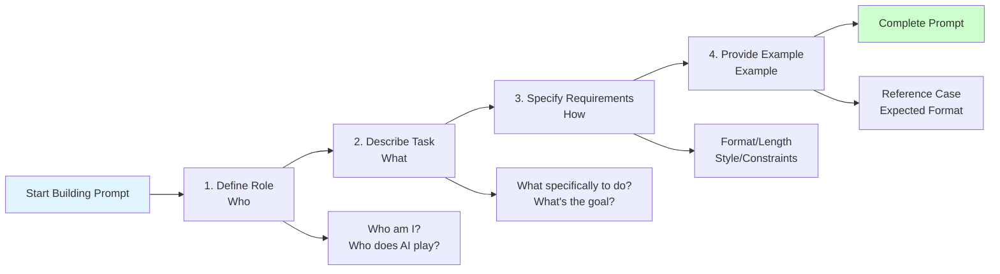
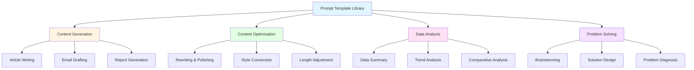
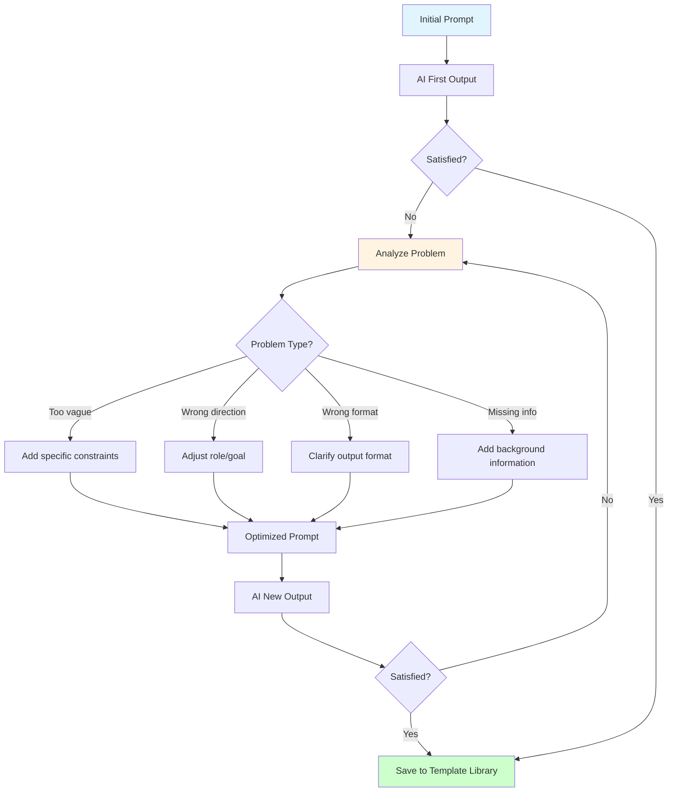

# Lesson 1: Prompt Engineering - Making AI Understand You

> **Duration**: 2 hours | **Difficulty**: Beginner | **Style**: Hands-on Practice

---

## 📋 Lesson Overview

This lesson will teach you how to write high-quality prompts that enable AI to accurately understand your needs and provide valuable outputs.

### 🎯 Key Insight

A prompt is not a "command," but rather an "opening line for a conversation." A good prompt requires:
- Clear role definition
- Specific task description
- Concrete output requirements
- Necessary contextual information

### 📚 What You Will Learn

- The 4 core elements of prompts
- 5 common prompt templates
- How to iteratively refine prompts
- Avoiding common prompt pitfalls

### 🎁 What You Will Take Away

- 40+ scenario-based prompt templates
- Prompt quality self-check checklist
- Role-specific prompt library

---

## 📖 Course Content

### 1. Basic Structure of Prompts

**Four Elements Framework**:

```
Role + Task + Requirements + Example
```

**Prompt Building Process Flow**:



**Example**:

```
You are a senior product manager (Role)
Please help me analyze the feasibility of this feature requirement (Task)
Analyze from three dimensions: technical implementation, user value, and business value (Requirements)
Reference format: [provide example] (Example)
```

### 2. Common Prompt Templates

**Prompt Template Classification Diagram**:



#### Template 1: Content Generation

```
I need to write a [document type] about [topic]
The target audience is [audience]
The core message to convey is [key points]
Style requirements: [formal/casual/professional, etc.]
Word count: [specific number]
```

#### Template 2: Content Optimization

```
Please help me optimize the following content:
[original content]

Optimization directions:
1. [direction 1]
2. [direction 2]
Maintain the original [characteristics to preserve]
```

#### Template 3: Data Analysis

```
Here is [data type] data:
[data content]

Please help me:
1. Identify [analysis dimension 1]
2. Analyze [analysis dimension 2]
3. Provide [conclusion type]
```

### 3. Hands-on Practice

**Prompt Iteration and Optimization Process**:



**Exercise 1: Write 3 Common Prompts for Your Role**

Select the 3 most common scenarios in your work and write a prompt template for each scenario.

**Exercise 2: Prompt Iteration and Optimization**

Select one prompt, continuously optimize it through 3 rounds of conversation, and record the improvements made each time.

---

## 💡 Role-Specific Examples

### Product Manager

**Scenario**: Writing User Stories

```
You are an agile development expert
Please help me convert the following requirement into user story format:
[requirement description]

Requirements:
- Use "As a... I want to... so that..." format
- Include acceptance criteria
- Mark priority level
```

### Operations

**Scenario**: Event Copywriting Generation

```
I need to write a set of promotional copy for [event name]
Event information:
- Time: [specific time]
- Target users: [user persona]
- Core selling points: [3 selling points]

Please generate:
1. Social media post (within 50 words)
2. Article headlines (3 alternatives)
3. SMS notification copy (within 70 words)
```

### Marketing

**Scenario**: Competitive Analysis

```
Please help me analyze the market positioning of [competitor name]
Analyze from the following dimensions:
1. Target user group
2. Core feature characteristics
3. Pricing strategy
4. Marketing strategy
5. Differentiation points from our product

Output format: Table comparison
```

---

## 🎯 After-Class Assignment

1. **Build a Personal Prompt Library**: Organize 10 commonly used prompt templates for your role
2. **Practical Application**: Use AI to complete a real work task, documenting the prompt iteration process
3. **Share and Exchange**: Share your best practices within your team

---

## 📚 Further Reading

- [OpenAI Prompt Engineering Guide](https://platform.openai.com/docs/guides/prompt-engineering)
- [Anthropic Prompt Library](https://docs.anthropic.com/claude/prompt-library)
- [Prompt Engineering Best Practices](https://www.promptingguide.ai/)

---

## ❓ Frequently Asked Questions

**Q: Are longer prompts better?**

A: No. Prompts should be "precise" rather than "lengthy." The key is providing necessary context and clear requirements.

**Q: How to judge prompt quality?**

A: Check if the output: 1) Meets expectations 2) Can be used directly 3) Reduces iteration rounds

**Q: Is there a difference between Chinese and English prompts?**

A: For models that support Chinese, Chinese prompts work well. However, certain professional terminology may be more accurate in English.
