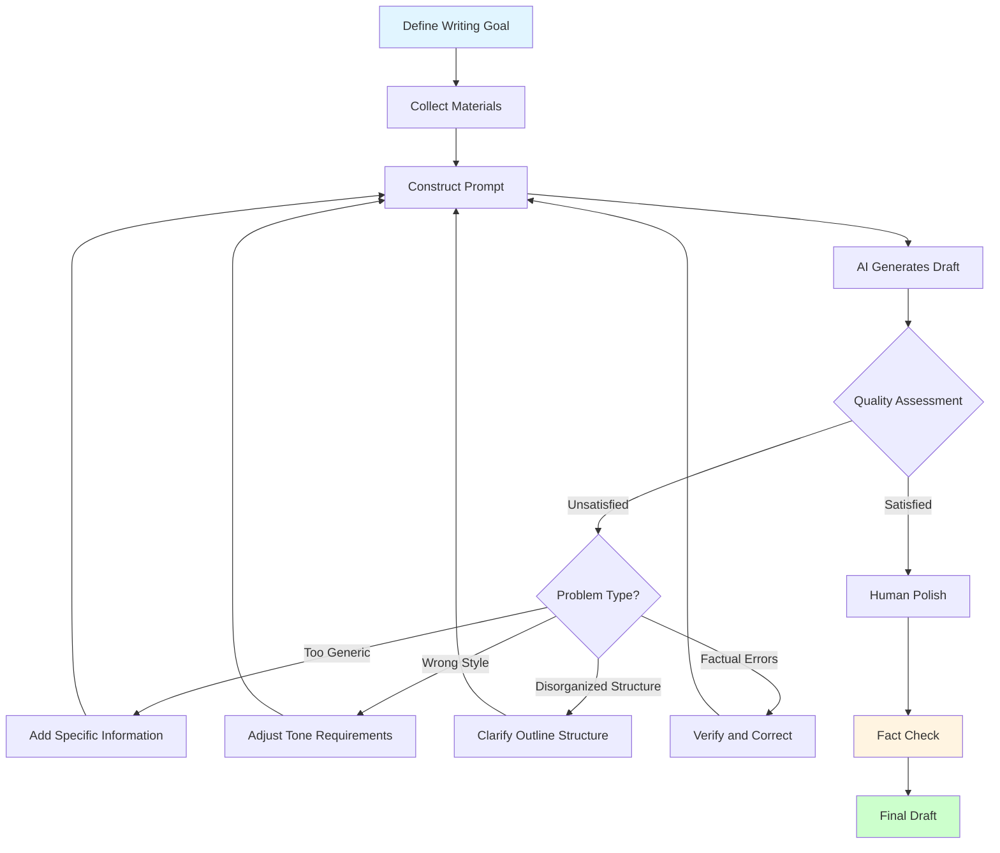
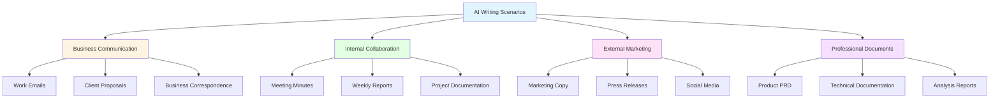
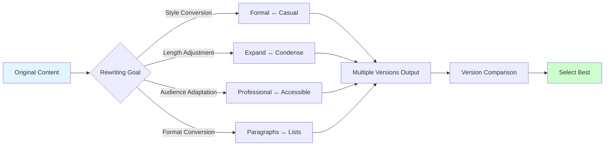

# Lesson 2: AI Writing Assistant - 10x Your Content Production Efficiency

> **Duration**: 2 hours | **Difficulty**: Beginner | **Style**: Scenario-based Practice

---

## 📋 Lesson Overview

### 🎯 Core Insight

AI doesn't replace your writing—it helps you:
- Overcome blank page anxiety
- Quickly generate first drafts
- Expand ideas from multiple angles
- Generate variations in bulk

### 📚 What You Will Learn

- AI writing workflows for 6 common document types
- How to make AI mimic your writing style
- 3 quality control checkpoints for content
- Fast multi-format content conversion

### 🎁 What You Will Take Away

- Writing templates for 6 document categories
- AI writing quality checklist
- Content rewriting prompt library

---

## 📖 Course Content

### 1. The Right Approach to AI Writing

**Complete AI Writing Workflow**:



**Three-Step Method**:

```
Step 1: Define Goal → Who is the audience? What is the purpose?
Step 2: Provide Materials → Give AI enough context
Step 3: Iterate and Optimize → If unsatisfied, follow up and adjust
```

### 2. Common Document Types

**Document Type Classification Diagram**:



#### Type 1: Work Emails

**Scenario**: Sending project progress updates to clients

```
Please help me write a project progress email:

Recipient: Client Project Manager
Background: Our project has entered the second phase
Information to convey:
1. Phase 1 is complete, deliverables have been sent
2. Phase 2 will start next week
3. We need the client to provide XX materials

Tone: Professional, friendly
```

#### Type 2: Meeting Minutes

**Scenario**: Organizing meeting recordings/notes

```
This is a record from a product review meeting:
[Paste meeting notes or transcription]

Please organize into formal meeting minutes, including:
1. Meeting basics (time, participants, topic)
2. Discussion points (listed item by item)
3. Decisions made (clearly marked)
4. Action items (responsible person + deadline)
```

#### Type 3: Product Documentation

**Scenario**: PRD (Product Requirements Document)

```
I need to write a PRD for [feature description]

Background:
- User pain point: [specific pain point]
- Business goal: [goal]
- Use case: [scenario]

Please output in the following structure:
1. Requirement Background
2. User Stories
3. Feature Description
4. Interaction Flow
5. Acceptance Criteria
```

### 3. Style Transfer Techniques

**Making AI Mimic Your Style**:

```
Here are 3 articles I wrote before:
[Article 1]
[Article 2]
[Article 3]

Please analyze my writing style characteristics, then write an article about [topic] in the same style.
```

### 4. Content Rewriting

**Content Rewriting Strategy Diagram**:



**Scenario**: Same content, multiple expressions

```
Please rewrite the following content into 3 versions:
[Original content]

Version 1: Formal, professional (for external reports)
Version 2: Relaxed, conversational (for internal sharing)
Version 3: Concise, bullet points (for PPT)
```

---

## 💡 Role-Specific Examples

### Product Manager

**Rapid Requirements Document Generation**

```
I need to write a requirements document for [feature name]

User research findings:
- [Finding 1]
- [Finding 2]

Competitive analysis:
- [Competitor approach]

Please help me generate:
1. Requirement Background (why)
2. Target Users (who)
3. Core Features (what)
4. Priority Ranking (what first)
```

### Operations

**Campaign Planning**

```
I'm planning a [campaign type] campaign

Goal: [specific goal, e.g., "acquire 1000 new registered users"]
Budget: [budget range]
Timeline: [campaign duration]

Please help me generate a campaign plan, including:
1. Campaign theme and slogan
2. Campaign mechanism design
3. Promotion channels and schedule
4. Expected results
```

### HR

**Job Description Writing**

```
I need to hire a [position title]

Requirements:
- Years of experience: [X years]
- Core skills: [skill list]
- Responsibilities: [main duties]

Company information:
- Industry: [industry]
- Size: [number of employees]
- Benefits: [benefit highlights]

Please generate an attractive job description, highlighting [company advantages]
```

---

## 🎯 Hands-on Practice

### Exercise 1: Writing Workflow Practice

Choose a document you need to write, complete it with AI assistance, and record:
1. Your initial prompt
2. AI's first output
3. Your feedback and revisions
4. Final version

### Exercise 2: Batch Content Generation

Use AI to generate 10 social media posts, requiring:
- Same topic
- Different angles
- Different lengths (short/medium/long)

---

## ⚠️ Quality Control Points

### Checkpoint 1: Factual Accuracy

- ❌ AI may fabricate data and cite non-existent sources
- ✅ All data, cases, and citations must be manually verified

### Checkpoint 2: Logical Coherence

- ❌ AI may have contradictions and weak arguments
- ✅ Check if arguments support conclusions and if the logic chain is complete

### Checkpoint 3: Style Consistency

- ❌ AI may have inconsistent style within the same document
- ✅ Ensure tone, word choice, and formatting are unified

---

## 📚 Further Reading

- [How to Improve Writing Efficiency with AI](https://example.com)
- [10 Best Practices for AI Writing](https://example.com)

---

## ❓ FAQ

**Q: Can I use AI-generated content directly?**

A: Not recommended. AI is an "assistant," not a "replacement." Generated content needs manual review, editing, and supplementation.

**Q: How can I avoid AI-generated content being generic?**

A: Provide specific context, examples, and data to let AI create based on real information.

**Q: Will AI writing be detected?**

A: Content that has been manually edited and supplemented is usually not detected as AI-generated. The key is to add your own thinking and unique insights.
