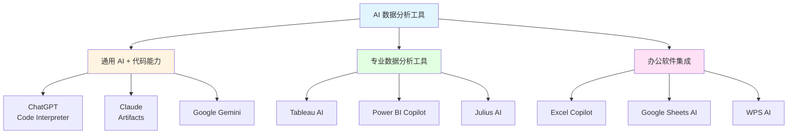
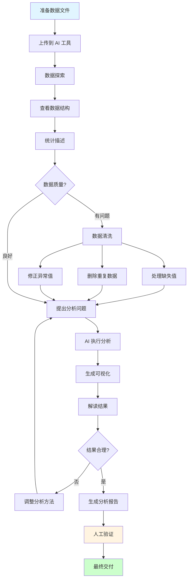
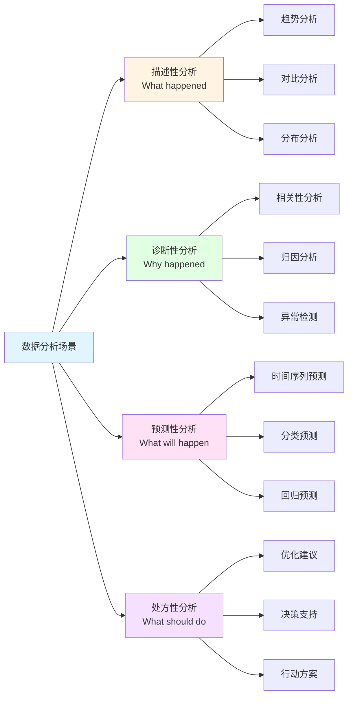

# 第 3 课：AI 数据分析 - 不写代码也能做分析

> **课程时长**: 2小时 | **难度**: 进阶 | **风格**: 实操为主

---

## 📋 本课概览

### 🎯 核心观点

AI 让数据分析不再是技术人员的专属技能。通过自然语言对话，你可以：
- 快速理解数据特征
- 发现数据中的规律
- 生成可视化图表
- 得出业务洞察

### 📚 你将学到

- 如何用 AI 进行数据清洗
- 常见数据分析场景的提示词
- 数据可视化的最佳实践
- 如何验证 AI 分析结果

### 🎁 你将带走

- 数据分析提示词模板库
- 常用图表类型选择指南
- 数据分析报告模板

---

## 📖 课程内容

### 1. AI 数据分析工具

**AI 数据分析工具生态图**：



**推荐工具**：
- ChatGPT Code Interpreter（付费）
- Claude with Artifacts（免费）
- Google Gemini（免费）
- 文心一言（免费）

### 2. 数据分析流程

**AI 数据分析完整流程图**：



```
第一步：上传数据 → CSV、Excel、JSON 等格式
第二步：数据探索 → 了解数据结构和特征
第三步：提出问题 → 用自然语言描述分析需求
第四步：验证结果 → 检查逻辑和计算是否正确
第五步：生成报告 → 整理成可分享的格式
```

### 3. 常见分析场景

**数据分析场景分类图**：



#### 场景 1：销售数据分析

```
这是我们过去 6 个月的销售数据：
[上传 CSV 文件]

请帮我分析：
1. 每月销售额趋势
2. 销售额 Top 5 的产品
3. 哪个地区销售最好
4. 给出提升销售的建议

请用图表展示关键数据。
```

#### 场景 2：用户行为分析

```
这是用户行为日志数据：
[上传数据]

请分析：
1. 用户活跃时段分布
2. 最常用的功能是什么
3. 用户流失的关键节点
4. 如何提升用户留存

输出：分析报告 + 可视化图表
```

#### 场景 3：问卷调查分析

```
这是一份用户满意度调查问卷的结果：
[上传数据]

请帮我：
1. 统计各题目的选项分布
2. 找出满意度最低的 3 个方面
3. 分析不同用户群体的差异
4. 生成可用于汇报的图表
```

---

## 💡 岗位专属案例

### 运营

**活动效果分析**

```
这是我们上周活动的数据：
- 参与人数：[数据]
- 转化率：[数据]
- 各渠道来源：[数据]

请分析：
1. 哪个渠道效果最好
2. 转化漏斗在哪个环节流失最多
3. 与上次活动对比如何
4. 下次活动的优化建议
```

### 产品经理

**功能使用分析**

```
这是新功能上线后的使用数据：
[上传数据]

请分析：
1. 功能使用率趋势
2. 哪些用户群体使用最多
3. 使用频次分布
4. 是否达到预期目标
```

### HR

**招聘数据分析**

```
这是今年的招聘数据：
[上传数据]

请分析：
1. 各岗位的招聘周期
2. 简历来源渠道效果
3. 面试通过率
4. 招聘成本分析
```

---

## 🎯 实战练习

### 练习 1：数据清洗

上传一份包含缺失值、重复数据的表格，让 AI 帮你清洗。

### 练习 2：趋势分析

用 AI 分析一组时间序列数据，生成趋势图和预测。

### 练习 3：对比分析

对比两组数据（如今年 vs 去年），找出差异和原因。

---

## ⚠️ 注意事项

### 数据安全

- ❌ 不要上传包含个人隐私的数据
- ❌ 不要上传公司机密数据
- ✅ 使用脱敏后的数据
- ✅ 使用样本数据进行测试

### 结果验证

- ❌ 不要盲目相信 AI 的计算结果
- ✅ 抽查关键数据点
- ✅ 用常识判断结果是否合理
- ✅ 重要决策前人工复核

---

## 📚 延伸阅读

- [数据分析基础知识](https://example.com)
- [常用图表类型及使用场景](https://example.com)
- [数据可视化最佳实践](https://example.com)

---

## ❓ 常见问题

**Q: AI 能处理多大的数据文件？**

A: 不同工具有不同限制。ChatGPT Code Interpreter 支持 100MB 以内，其他工具通常在 10-50MB。

**Q: AI 分析结果准确吗？**

A: AI 可能出现计算错误或理解偏差。关键数据必须人工验证。

**Q: 如何让 AI 生成更专业的图表？**

A: 明确指定图表类型、配色方案、标签格式等细节要求。
