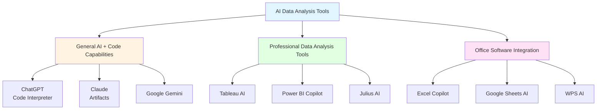
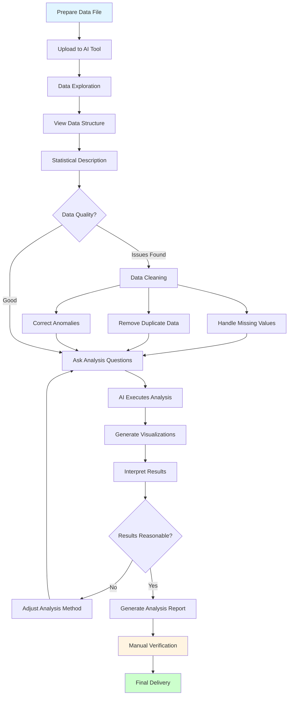
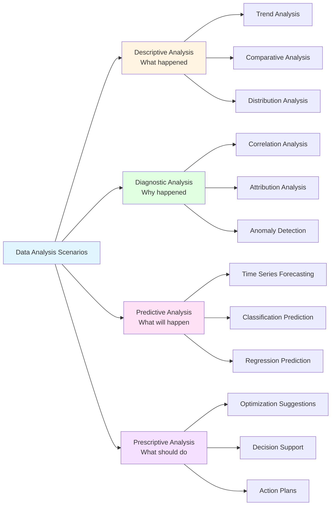

# Lesson 3: AI Data Analysis - Doing Analysis Without Writing Code

> **Course Duration**: 2 hours | **Difficulty**: Intermediate | **Style**: Hands-on Practice

---

## 📋 Lesson Overview

### 🎯 Core Concepts

AI makes data analysis no longer an exclusive skill for technical professionals. Through natural language conversation, you can:
- Quickly understand data characteristics
- Discover patterns in data
- Generate visualization charts
- Derive business insights

### 📚 What You Will Learn

- How to use AI for data cleaning
- Prompts for common data analysis scenarios
- Best practices for data visualization
- How to validate AI analysis results

### 🎁 What You Will Take Away

- Data analysis prompt template library
- Common chart type selection guide
- Data analysis report template

---

## 📖 Course Content

### 1. AI Data Analysis Tools

**AI Data Analysis Tool Ecosystem Diagram**:



**Recommended Tools**:
- ChatGPT Code Interpreter (Paid)
- Claude with Artifacts (Free)
- Google Gemini (Free)
- Ernie Bot (Free)

### 2. Data Analysis Process

**Complete AI Data Analysis Flowchart**:



```
Step 1: Upload Data → CSV, Excel, JSON and other formats
Step 2: Data Exploration → Understand data structure and characteristics
Step 3: Ask Questions → Describe analysis requirements in natural language
Step 4: Validate Results → Check if logic and calculations are correct
Step 5: Generate Report → Organize into shareable format
```

### 3. Common Analysis Scenarios

**Data Analysis Scenario Classification Diagram**:



#### Scenario 1: Sales Data Analysis

```
Here is our sales data for the past 6 months:
[Upload CSV file]

Please help me analyze:
1. Monthly sales trend
2. Top 5 products by sales
3. Which region has the best sales
4. Suggestions for improving sales

Please display key data with charts.
```

#### Scenario 2: User Behavior Analysis

```
Here is user behavior log data:
[Upload data]

Please analyze:
1. User activity time distribution
2. What are the most commonly used features
3. Key points of user churn
4. How to improve user retention

Output: Analysis report + visualization charts
```

#### Scenario 3: Survey Analysis

```
Here are the results of a user satisfaction survey:
[Upload data]

Please help me:
1. Calculate the distribution of options for each question
2. Find the 3 aspects with lowest satisfaction
3. Analyze differences between user groups
4. Generate charts suitable for presentation
```

---

## 💡 Role-Specific Examples

### Operations

**Campaign Performance Analysis**

```
Here is the data from our campaign last week:
- Participants: [data]
- Conversion rate: [data]
- Traffic by channel: [data]

Please analyze:
1. Which channel performed best
2. At which stage of the conversion funnel was the most drop-off
3. How does it compare to the previous campaign
4. Optimization suggestions for the next campaign
```

### Product Manager

**Feature Usage Analysis**

```
Here is the usage data after the new feature launch:
[Upload data]

Please analyze:
1. Feature usage trend
2. Which user groups use it most
3. Usage frequency distribution
4. Whether it achieved expected goals
```

### HR

**Recruitment Data Analysis**

```
Here is this year's recruitment data:
[Upload data]

Please analyze:
1. Recruitment cycle by position
2. Effectiveness of resume source channels
3. Interview pass rate
4. Recruitment cost analysis
```

---

## 🎯 Hands-on Exercises

### Exercise 1: Data Cleaning

Upload a spreadsheet containing missing values and duplicate data, and let AI help you clean it.

### Exercise 2: Trend Analysis

Use AI to analyze a set of time series data and generate trend charts and forecasts.

### Exercise 3: Comparative Analysis

Compare two sets of data (e.g., this year vs. last year) and identify differences and reasons.

---

## ⚠️ Important Notes

### Data Security

- ❌ Do not upload data containing personal privacy information
- ❌ Do not upload company confidential data
- ✅ Use anonymized data
- ✅ Use sample data for testing

### Result Validation

- ❌ Do not blindly trust AI calculation results
- ✅ Spot-check key data points
- ✅ Use common sense to judge if results are reasonable
- ✅ Manually review before making important decisions

---

## 📚 Further Reading

- [Data Analysis Basics](https://example.com)
- [Common Chart Types and Use Cases](https://example.com)
- [Data Visualization Best Practices](https://example.com)

---

## ❓ Frequently Asked Questions

**Q: How large a data file can AI process?**

A: Different tools have different limits. ChatGPT Code Interpreter supports up to 100MB, while other tools typically handle 10-50MB.

**Q: Are AI analysis results accurate?**

A: AI may produce calculation errors or understanding biases. Key data must be manually verified.

**Q: How can I get AI to generate more professional charts?**

A: Clearly specify chart type, color scheme, label format, and other detailed requirements.
