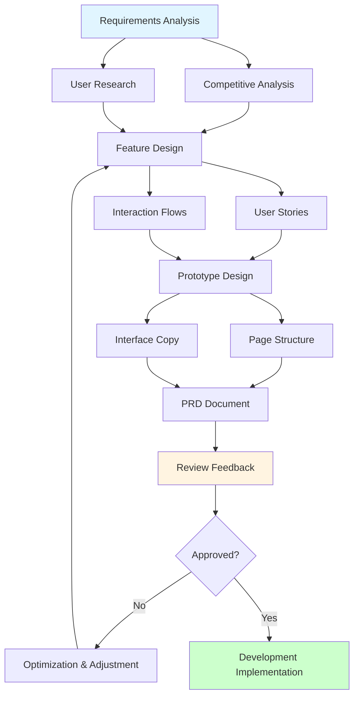
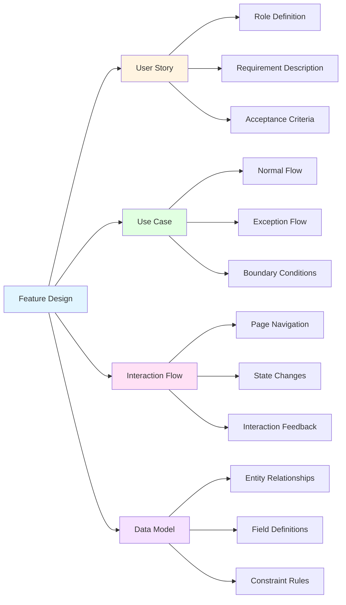

# Lesson 4: AI Product Design - From Requirements to Prototype

> **Duration**: 2 hours | **Level**: Intermediate | **Style**: Scenario-based Practice

---

## 📋 Lesson Overview

### 🎯 Key Concepts

AI can assist with the entire product design process:
- Requirements analysis and user research
- Feature design and interaction flows
- Prototypes and interface design
- Documentation and reviews

### 📚 What You Will Learn

- How to use AI for competitive analysis
- User stories and use case design
- Prototype generation techniques
- Rapid PRD document generation

### 🎁 Takeaways

- Complete product design process template
- Prototype design prompt library
- PRD document template

---

## 📖 Course Content

### 1. Requirements Analysis Phase

**Complete Product Design Flowchart**:



#### Competitive Analysis

```
Please help me analyze the product features of [Competitor Name]

Analysis dimensions:
1. Target user groups
2. Core feature list
3. Interaction design highlights
4. Business model
5. Strengths and weaknesses

Output format: Structured table
```

#### User Personas

```
Our product is [Product Description]

Please help me create 3 typical user personas, including:
- Basic information (age, occupation, income)
- Usage scenarios
- Pain points and needs
- Usage motivation
```

### 2. Feature Design Phase

**Feature Design Mind Map**:



#### User Stories

```
Feature requirement: [Feature Description]

Please generate 5 user stories in the format:
"As a [role], I want [feature], so that [goal]"

Each story should include:
- Acceptance criteria
- Priority (P0/P1/P2)
- Estimated effort
```

#### Interaction Flow

```
Feature: [Feature Name]

Please design a complete interaction flow, including:
1. User operation steps
2. System responses
3. Exception handling
4. Boundary conditions

Present using a flowchart or step list.
```

### 3. Prototype Design Phase

#### Page Structure

```
I need to design a prototype for [Page Name]

Page goal: [Goal Description]
Core features: [Feature List]
Target users: [User Description]

Please provide:
1. Page layout suggestions
2. Key element positioning
3. Interaction specifications
4. Copy suggestions
```

#### Interface Copy

```
Feature: [Feature Description]

Please write copy for the following interface elements:
1. Page title
2. Button text
3. Prompt messages
4. Error messages
5. Empty state copy

Requirements: Concise, friendly, consistent with [Brand Tone]
```

### 4. Documentation Phase

#### PRD Document

```
I need to write a PRD for [Feature Name]

Background information:
- User pain points: [Pain Point Description]
- Business goals: [Goal Description]
- Usage scenarios: [Scenario Description]

Please output in the following structure:
1. Requirement Background
2. Target Users
3. Feature Description
4. Interaction Flow
5. Data Tracking
6. Acceptance Criteria
```

---

## 💡 Role-Specific Cases

### Product Manager

**Quick MVP Output**

```
We want to build a [Product Type] product

Goal: [Business Goal]
Constraints: [Time/Staff/Budget]

Please help me design an MVP plan:
1. Core features (must-have)
2. Secondary features (can be iterated later)
3. Technical solution suggestions
4. Development timeline suggestions
```

### UX Designer

**Interaction Design Review**

```
Here is the interaction flow I designed:
[Description or upload prototype]

Please review from the following perspectives:
1. Is the user experience smooth?
2. Does it follow common interaction patterns?
3. Are edge cases thoroughly considered?
4. Optimization suggestions
```

### Operations

**Event Page Design**

```
I need to design an [Event Type] event page

Event information:
- Theme: [Theme]
- Goal: [Goal]
- Selling points: [Selling Point List]

Please provide:
1. Page structure suggestions
2. Visual style suggestions
3. Copy framework
4. CTA button design
```

---

## 🎯 Practical Exercises

### Exercise 1: Complete Product Design Process

Choose a small feature and use AI to complete the entire process from requirements to prototype.

### Exercise 2: Competitive Analysis

Select 3 competitors and use AI to generate a comparative analysis report.

### Exercise 3: PRD Writing

Write a PRD for a real requirement using AI assistance.

---

## 🛠️ Recommended Tools

### Prototype Design Tools

- **Figma** + AI plugins (e.g., Magician)
- **Instant Design** + AI features
- **Uizard** (AI prototype generation)

### Documentation Tools

- **Notion AI**
- **Feishu Docs AI**
- **Yuque AI**

---

## ⚠️ Important Notes

### AI Limitations

- ❌ AI cannot replace user research
- ❌ AI cannot make business decisions
- ✅ AI is an assistive tool; final decisions need human judgment
- ✅ AI-generated solutions need to be adjusted based on actual conditions

---

## 📚 Further Reading

- [Product Design Methodology](https://example.com)
- [User Experience Design Principles](https://example.com)
- [PRD Writing Best Practices](https://example.com)

---

## ❓ FAQ

**Q: Can AI directly generate usable prototypes?**

A: Currently, AI mainly generates text descriptions and simple diagrams. Professional prototypes still require design tools.

**Q: How can I help AI understand our product style?**

A: Provide screenshots of existing products, design specifications, and brand guidelines as references.

**Q: Can AI-generated PRDs be given directly to developers?**

A: Manual review and adding details are needed, especially for technical implementation and boundary conditions.
