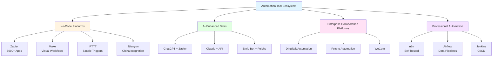
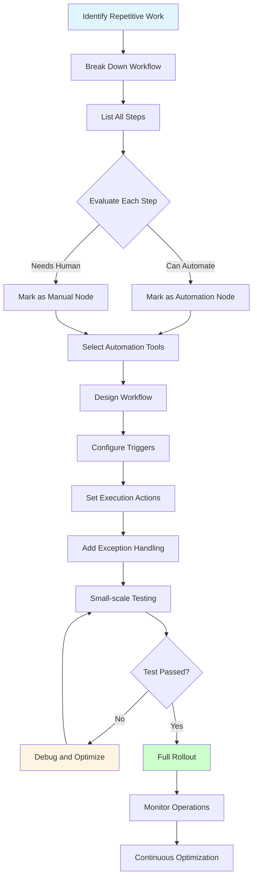

# Lesson 5: AI Workflow Automation - Making Repetitive Work Disappear

> **Duration**: 2 hours | **Difficulty**: Advanced | **Style**: Hands-on Practice

---

## 📋 Lesson Overview

### 🎯 Core Concepts

AI can not only help you complete individual tasks, but also connect multiple steps to achieve workflow automation:
- Automate repetitive work
- Use multiple tools collaboratively
- Build personal knowledge bases
- Improve team collaboration efficiency

### 📚 What You Will Learn

- Identify work scenarios that can be automated
- Use common automation tools
- How to design automated workflows
- Combine AI + automation tools

### 🎁 What You Will Take Away

- 10 common automation scenario templates
- Workflow design checklist
- Automation tool selection guide

---

## 📖 Course Content

### 1. Automatable Work Scenarios

**Identification Criteria**:
- ✅ High repetitiveness (needs to be done weekly/monthly)
- ✅ Clear rules (fixed steps)
- ✅ Time-consuming (over 30 minutes)
- ✅ Error-prone (easy to miss with manual operation)

**Common Scenarios**:
1. Periodic report generation
2. Data collection and organization
3. Batch email sending
4. Document format conversion
5. Social media content publishing

### 2. Automation Tool Ecosystem

**Automation Tool Ecosystem Diagram**:



#### No-Code Automation Platforms

**International Tools**:
- **Zapier** - Connects 5000+ apps
- **Make (Integromat)** - Visual workflows
- **IFTTT** - Simple trigger-action

**Chinese Tools**:
- **Jijianyun** - Domestic app integration
- **Jiandaoyun** - Low-code platform
- **DingTalk/Feishu** - Enterprise automation

#### AI-Enhanced Tools

- **ChatGPT + Zapier** - AI-driven automation
- **Claude + API** - Custom AI workflows
- **Ernie Bot + Feishu** - Chinese solution

### 3. Workflow Design Method

**Automated Workflow Design Process**:



**Four-Step Method**:

```
Step 1: Break Down Process → List all steps
Step 2: Identify Nodes → Which steps can be automated
Step 3: Select Tools → Match appropriate tools
Step 4: Test and Optimize → Test on small scale before rolling out
```

**Example: Weekly Report Auto-Generation**

```
Manual Process:
1. Open project management tool, export this week's tasks
2. Organize into document format
3. Add data analysis
4. Send to manager

Automated Process:
1. [Auto] Trigger every Friday at 5 PM
2. [Auto] Pull data from project management tool
3. [AI] Generate weekly report document
4. [Auto] Send email
```

### 4. Practical Cases

#### Case 1: Social Media Content Publishing

**Scenario**: Publishing content on multiple platforms daily

**Workflow**:
```
1. Write content in Notion
2. [Trigger] Mark as "To Publish"
3. [AI] Adjust format and length for different platforms
4. [Auto] Schedule publishing to each platform
5. [Auto] Record publishing results
```

**Tool Combination**:
- Notion (Content management)
- ChatGPT (Content rewriting)
- Zapier (Automation orchestration)
- Platform APIs (Publishing)

#### Case 2: Customer Feedback Collection and Analysis

**Scenario**: Organizing customer feedback weekly

**Workflow**:
```
1. [Auto] Collect feedback from multiple channels
   - Email
   - Online forms
   - Customer service system
2. [AI] Classify and tag
3. [AI] Generate analysis report
4. [Auto] Send to product team
```

#### Case 3: Meeting Notes Automation

**Scenario**: Organizing notes after meetings

**Workflow**:
```
1. [Auto] Transcribe meeting recording to text
2. [AI] Extract key information
   - Discussion points
   - Decisions
   - Action items
3. [AI] Generate structured notes
4. [Auto] Send to attendees
5. [Auto] Sync action items to task system
```

---

## 💡 Role-Specific Cases

### Operations

**Campaign Data Daily Report**

```
Auto-generated every morning at 9 AM:
1. Pull yesterday's data from data platform
2. AI generates data analysis and trends
3. Send to operations group
```

### Product Manager

**Requirement Collection and Organization**

```
Auto-organized weekly:
1. Collect requirements from multiple channels
2. AI deduplicates and classifies
3. Generate requirement pool report
4. Sync to project management tool
```

### HR

**Resume Screening**

```
Auto-triggered when resume received:
1. AI extracts key information
2. Match job requirements
3. Generate initial screening results
4. Notify hiring manager
```

---

## 🎯 Hands-on Exercises

### Exercise 1: Design Your First Automated Workflow

Choose a repetitive task and design an automation plan:
1. Draw the current process flow
2. Mark automatable nodes
3. Select appropriate tools
4. Write implementation plan

### Exercise 2: Build a Simple Automation

Use Zapier or Jijianyun to build a simple automation:
- New email → AI summary → Send to Slack
- Form submission → AI classification → Record to spreadsheet

---

## 🛠️ Recommended Tools

### Automation Platforms

| Tool | Use Case | Pricing |
|------|----------|---------|
| Zapier | International app integration | Free tier + Paid |
| Make | Complex workflows | Free tier + Paid |
| Jijianyun | Chinese app integration | Free tier + Paid |
| n8n | Self-hosted open source | Free |

### AI Tools

- **ChatGPT API** - Most powerful, requires payment
- **Claude API** - Good for long texts
- **Ernie Bot API** - Chinese solution

---

## ⚠️ Important Notes

### Data Security

- ❌ Do not transmit sensitive data in automation workflows
- ✅ Use enterprise version tools to ensure data security
- ✅ Regularly review automation workflow permissions

### Error Handling

- ✅ Set up exception notifications
- ✅ Keep human review checkpoints
- ✅ Regularly check automation results

---

## 📚 Further Reading

- [Automated Workflow Design Guide](https://example.com)
- [Zapier Official Tutorial](https://zapier.com/learn)
- [AI Automation Best Practices](https://example.com)

---

## ❓ Frequently Asked Questions

**Q: Will automation make me lose my job?**

A: Automation frees you from repetitive labor so you can do more valuable work.

**Q: Do I need programming skills to set up automation?**

A: No. Modern automation tools are visual - you can complete them with drag and drop.

**Q: What if the automation makes an error?**

A: Set up exception notifications, keep human review checkpoints, and regularly check results.