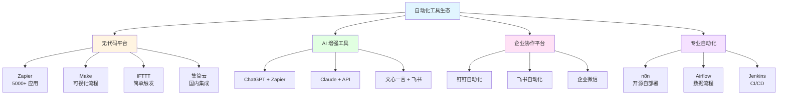
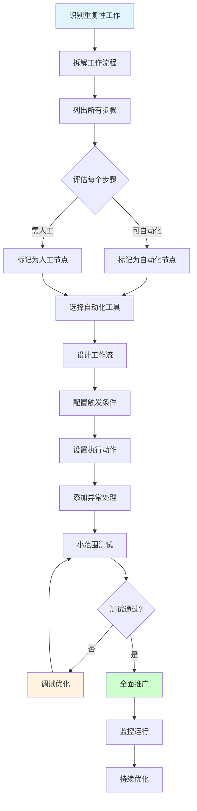

# 第 5 课：AI 工作流自动化 - 让重复工作消失

> **课程时长**: 2小时 | **难度**: 进阶 | **风格**: 实操为主

---

## 📋 本课概览

### 🎯 核心观点

AI 不仅能帮你完成单个任务，还能串联多个步骤，实现工作流自动化：
- 自动化重复性工作
- 多工具协同使用
- 建立个人知识库
- 提升团队协作效率

### 📚 你将学到

- 识别可自动化的工作场景
- 常见自动化工具的使用
- 如何设计自动化工作流
- AI + 自动化工具的组合使用

### 🎁 你将带走

- 10 个常见自动化场景模板
- 工作流设计检查清单
- 自动化工具选型指南

---

## 📖 课程内容

### 1. 可自动化的工作场景

**识别标准**：
- ✅ 重复性高（每周/每月都要做）
- ✅ 规则明确（步骤固定）
- ✅ 耗时较长（超过 30 分钟）
- ✅ 容易出错（人工操作易疏漏）

**常见场景**：
1. 定期报告生成
2. 数据收集和整理
3. 邮件批量发送
4. 文档格式转换
5. 社交媒体内容发布

### 2. 自动化工具生态

**自动化工具生态图**：



#### 无代码自动化平台

**国外工具**：
- **Zapier** - 连接 5000+ 应用
- **Make (Integromat)** - 可视化工作流
- **IFTTT** - 简单的触发-动作

**国内工具**：
- **集简云** - 国内应用集成
- **简道云** - 低代码平台
- **钉钉/飞书** - 企业自动化

#### AI 增强工具

- **ChatGPT + Zapier** - AI 驱动的自动化
- **Claude + API** - 自定义 AI 工作流
- **文心一言 + 飞书** - 国内方案

### 3. 工作流设计方法

**自动化工作流设计流程**：



**四步法**：

```
第一步：拆解流程 → 列出所有步骤
第二步：识别节点 → 哪些步骤可以自动化
第三步：选择工具 → 匹配合适的工具
第四步：测试优化 → 小范围测试后推广
```

**示例：周报自动生成**

```
手动流程：
1. 打开项目管理工具，导出本周任务
2. 整理成文档格式
3. 添加数据分析
4. 发送给领导

自动化流程：
1. [自动] 每周五下午 5 点触发
2. [自动] 从项目管理工具拉取数据
3. [AI] 生成周报文档
4. [自动] 发送邮件
```

### 4. 实战案例

#### 案例 1：社交媒体内容发布

**场景**：每天在多个平台发布内容

**工作流**：
```
1. 在 Notion 中写好内容
2. [触发] 标记为"待发布"
3. [AI] 根据不同平台调整格式和长度
4. [自动] 定时发布到各平台
5. [自动] 记录发布结果
```

**工具组合**：
- Notion（内容管理）
- ChatGPT（内容改写）
- Zapier（自动化编排）
- 各平台 API（发布）

#### 案例 2：客户反馈收集分析

**场景**：每周整理客户反馈

**工作流**：
```
1. [自动] 从多个渠道收集反馈
   - 邮件
   - 在线表单
   - 客服系统
2. [AI] 分类和打标签
3. [AI] 生成分析报告
4. [自动] 发送给产品团队
```

#### 案例 3：会议纪要自动化

**场景**：会议后整理纪要

**工作流**：
```
1. [自动] 会议录音转文字
2. [AI] 提取关键信息
   - 讨论要点
   - 决策事项
   - 待办任务
3. [AI] 生成结构化纪要
4. [自动] 发送给参会人员
5. [自动] 待办事项同步到任务系统
```

---

## 💡 岗位专属案例

### 运营

**活动数据日报**

```
每天早上 9 点自动生成：
1. 从数据平台拉取昨日数据
2. AI 生成数据分析和趋势
3. 发送到运营群
```

### 产品经理

**需求收集整理**

```
每周自动整理：
1. 从多个渠道收集需求
2. AI 去重和分类
3. 生成需求池报告
4. 同步到项目管理工具
```

### HR

**简历筛选**

```
收到简历后自动：
1. AI 提取关键信息
2. 匹配岗位要求
3. 生成初筛结果
4. 通知招聘负责人
```

---

## 🎯 实战练习

### 练习 1：设计你的第一个自动化工作流

选择一个重复性工作，设计自动化方案：
1. 画出当前流程图
2. 标注可自动化的节点
3. 选择合适的工具
4. 写出实施计划

### 练习 2：搭建简单的自动化

用 Zapier 或集简云搭建一个简单的自动化：
- 新邮件 → AI 总结 → 发送到 Slack
- 表单提交 → AI 分类 → 记录到表格

---

## 🛠️ 推荐工具

### 自动化平台

| 工具 | 适用场景 | 价格 |
|------|----------|------|
| Zapier | 国外应用集成 | 免费版 + 付费 |
| Make | 复杂工作流 | 免费版 + 付费 |
| 集简云 | 国内应用集成 | 免费版 + 付费 |
| n8n | 开源自部署 | 免费 |

### AI 工具

- **ChatGPT API** - 最强大，需付费
- **Claude API** - 长文本处理好
- **文心一言 API** - 国内方案

---

## ⚠️ 注意事项

### 数据安全

- ❌ 不要在自动化流程中传输敏感数据
- ✅ 使用企业版工具，确保数据安全
- ✅ 定期审查自动化流程的权限

### 错误处理

- ✅ 设置异常通知
- ✅ 保留人工审核环节
- ✅ 定期检查自动化结果

---

## 📚 延伸阅读

- [自动化工作流设计指南](https://example.com)
- [Zapier 官方教程](https://zapier.com/learn)
- [AI 自动化最佳实践](https://example.com)

---

## ❓ 常见问题

**Q: 自动化会不会让我失业？**

A: 自动化是让你从重复劳动中解放出来，去做更有价值的工作。

**Q: 搭建自动化需要编程基础吗？**

A: 不需要。现代自动化工具都是可视化的，拖拽即可完成。

**Q: 自动化出错了怎么办？**

A: 设置异常通知，保留人工审核环节，定期检查结果。
