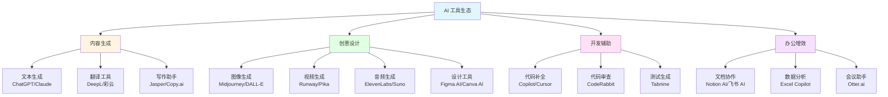
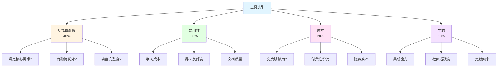
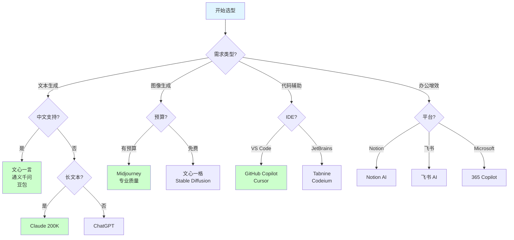

# 第 6 课：AI 工具生态 - 选型与组合

> **课程时长**: 2小时 | **难度**: 进阶 | **风格**: 实用指南

---

## 📋 本课概览

### 🎯 核心观点

AI 工具层出不穷，关键不是追逐最新工具，而是：
- 建立工具选型框架
- 掌握工具组合使用
- 培养工具评估能力
- 形成个人工具箱

### 📚 你将学到

- AI 工具的分类和特点
- 如何选择适合自己的工具
- 工具组合使用的最佳实践
- 如何快速上手新工具

### 🎁 你将带走

- AI 工具全景图
- 工具选型决策树
- 个人工具箱模板

---

## 📖 课程内容

### 1. AI 工具分类

**AI 工具全景图**：



#### 按功能分类

**文本生成类**：
- ChatGPT、Claude、文心一言
- Notion AI、飞书文档 AI
- Jasper、Copy.ai

**图像生成类**：
- Midjourney、DALL-E、Stable Diffusion
- 文心一格、通义万相

**视频生成类**：
- Runway、Pika、Sora（未来）
- 剪映 AI、必剪

**音频生成类**：
- ElevenLabs（语音合成）
- Suno、Udio（音乐生成）

**代码辅助类**：
- GitHub Copilot、Cursor
- Tabnine、Codeium

**办公增效类**：
- Notion AI、飞书 AI
- Microsoft 365 Copilot
- WPS AI

### 2. 工具选型框架

**工具选型四维评估模型**：



**四维评估法**：

```
维度 1：功能匹配度（40%）
- 是否满足核心需求？
- 是否有独特优势？

维度 2：易用性（30%）
- 学习成本高吗？
- 界面友好吗？

维度 3：成本（20%）
- 免费版够用吗？
- 付费版性价比如何？

维度 4：生态（10%）
- 是否支持集成？
- 社区活跃吗？
```

**工具选型决策树**：



### 3. 工具组合使用

#### 组合 1：内容创作流程

```
1. ChatGPT - 生成大纲和初稿
2. Grammarly - 语法检查
3. Hemingway - 可读性优化
4. Midjourney - 配图生成
5. Notion - 内容管理
```

#### 组合 2：产品设计流程

```
1. ChatGPT - 需求分析和头脑风暴
2. Figma + AI 插件 - 原型设计
3. Notion AI - PRD 撰写
4. Loom - 演示视频录制
```

#### 组合 3：数据分析流程

```
1. ChatGPT Code Interpreter - 数据分析
2. Tableau - 可视化
3. Notion AI - 报告撰写
4. 飞书 - 分享和协作
```

### 4. 快速上手新工具

**三步法**：

```
第一步：看官方教程（10 分钟）
- 了解核心功能
- 看示例案例

第二步：动手实践（30 分钟）
- 用自己的真实需求测试
- 记录优缺点

第三步：对比评估（10 分钟）
- 与现有工具对比
- 决定是否采用
```

---

## 💡 岗位专属工具箱

### 产品经理

**核心工具**：
- ChatGPT/Claude - 需求分析、PRD 撰写
- Figma + AI 插件 - 原型设计
- Notion AI - 文档管理
- Miro - 头脑风暴

**工作流**：
```
需求收集 → AI 分析 → 原型设计 → PRD 撰写 → 评审
```

### 运营

**核心工具**：
- ChatGPT - 文案生成
- Midjourney - 配图设计
- 剪映 AI - 视频制作
- 飞书 AI - 数据分析

**工作流**：
```
选题策划 → 内容创作 → 视觉设计 → 发布 → 数据分析
```

### 市场

**核心工具**：
- Jasper/Copy.ai - 营销文案
- Canva AI - 设计素材
- HubSpot AI - 营销自动化
- Google Analytics - 数据追踪

**工作流**：
```
市场调研 → 策略制定 → 内容生产 → 投放 → 效果分析
```

### HR

**核心工具**：
- ChatGPT - JD 撰写、面试题库
- Notion AI - 培训材料
- 飞书招聘 - 招聘管理
- 问卷星 - 调研收集

**工作流**：
```
岗位分析 → JD 撰写 → 简历筛选 → 面试 → 入职培训
```

---

## 🎯 实战练习

### 练习 1：构建个人工具箱

列出你的工作场景，为每个场景选择 1-2 个工具。

### 练习 2：工具对比评估

选择 3 个同类工具，用四维评估法对比，选出最适合你的。

### 练习 3：工具组合实践

设计一个完整的工作流，串联 3-5 个工具。

---

## 📊 工具对比表

### 文本生成工具对比

| 工具 | 优势 | 劣势 | 价格 | 推荐场景 |
|------|------|------|------|----------|
| ChatGPT | 功能强大、生态丰富 | 需要翻墙 | $20/月 | 通用场景 |
| Claude | 长文本处理好 | 国内访问不稳定 | $20/月 | 长文档分析 |
| 文心一言 | 免费、中文好 | 功能相对弱 | 免费 | 国内用户 |
| 通义千问 | 免费、集成阿里生态 | 功能相对弱 | 免费 | 阿里系用户 |

### 图像生成工具对比

| 工具 | 优势 | 劣势 | 价格 | 推荐场景 |
|------|------|------|------|----------|
| Midjourney | 质量最高 | 需要翻墙 | $10-60/月 | 专业设计 |
| DALL-E | 易用性好 | 风格相对单一 | 按次付费 | 快速出图 |
| 文心一格 | 免费、中文好 | 质量一般 | 免费 | 国内用户 |
| Stable Diffusion | 开源、可控性强 | 学习成本高 | 免费 | 技术用户 |

---

## ⚠️ 工具选择建议

### 避免的误区

- ❌ 追逐最新工具，频繁更换
- ❌ 工具太多，反而降低效率
- ❌ 只用免费工具，忽视付费工具的价值
- ❌ 不学习就放弃，没有给工具足够的时间

### 正确的做法

- ✅ 先用免费版测试，确认有价值再付费
- ✅ 保持 3-5 个核心工具，深度使用
- ✅ 定期（每季度）评估工具，淘汰不用的
- ✅ 关注工具更新，学习新功能

---

## 📚 延伸阅读

- [AI 工具导航网站](https://www.futuretools.io/)
- [AI 工具评测](https://www.aitools.fyi/)
- [产品猎人 AI 分类](https://www.producthunt.com/topics/artificial-intelligence)

---

## ❓ 常见问题

**Q: 工具太多，如何选择？**

A: 从需求出发，不是从工具出发。先明确要解决什么问题，再找工具。

**Q: 免费工具够用吗？**

A: 入门阶段够用。但如果工具能显著提升效率，付费是值得的。

**Q: 如何跟上工具更新？**

A: 关注几个 AI 工具导航网站，每月花 1 小时了解新工具即可。
