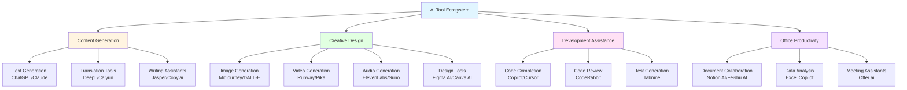
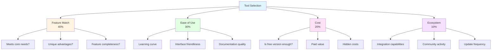
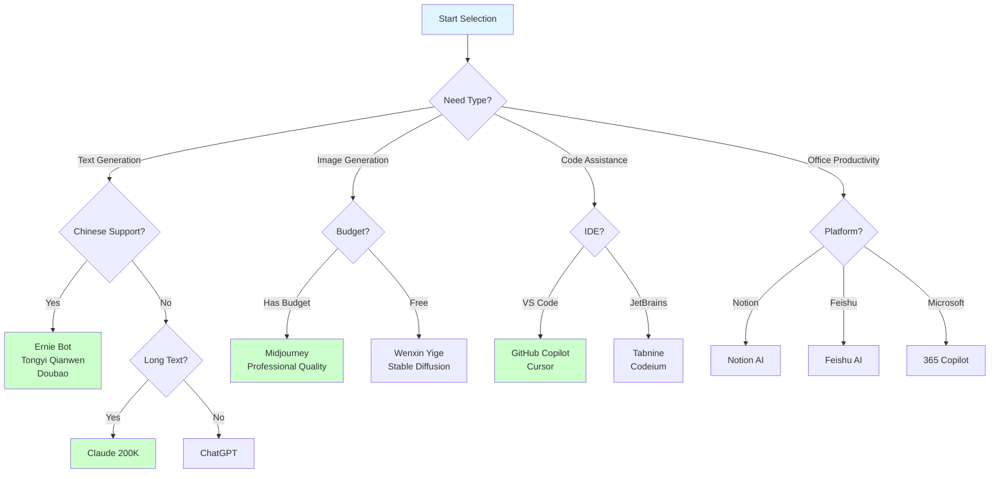

# Lesson 6: AI Tool Ecosystem - Selection and Combination

> **Duration**: 2 hours | **Difficulty**: Intermediate | **Style**: Practical Guide

---

## 📋 Lesson Overview

### 🎯 Key Takeaways

AI tools are constantly emerging. The key is not to chase the latest tools, but to:
- Build a tool selection framework
- Master tool combinations
- Develop tool evaluation skills
- Form a personal toolkit

### 📚 You Will Learn

- Classification and characteristics of AI tools
- How to choose tools that suit you
- Best practices for combining tools
- How to quickly get started with new tools

### 🎁 You Will Take Away

- AI tool landscape map
- Tool selection decision tree
- Personal toolkit template

---

## 📖 Course Content

### 1. AI Tool Classification

**AI Tool Landscape**:



#### Classification by Function

**Text Generation**:
- ChatGPT, Claude, Ernie Bot
- Notion AI, Feishu Document AI
- Jasper, Copy.ai

**Image Generation**:
- Midjourney, DALL-E, Stable Diffusion
- Wenxin Yige, Tongyi Wanxiang

**Video Generation**:
- Runway, Pika, Sora (upcoming)
- Jianying AI, Bibei

**Audio Generation**:
- ElevenLabs (voice synthesis)
- Suno, Udio (music generation)

**Code Assistance**:
- GitHub Copilot, Cursor
- Tabnine, Codeium

**Office Productivity**:
- Notion AI, Feishu AI
- Microsoft 365 Copilot
- WPS AI

### 2. Tool Selection Framework

**Four-Dimensional Tool Selection Assessment Model**:



**Four-Dimensional Assessment Method**:

```
Dimension 1: Feature Match (40%)
- Does it meet core needs?
- Does it have unique advantages?

Dimension 2: Ease of Use (30%)
- Is the learning curve steep?
- Is the interface user-friendly?

Dimension 3: Cost (20%)
- Is the free version enough?
- How is the paid version's value?

Dimension 4: Ecosystem (10%)
- Does it support integration?
- Is the community active?
```

**Tool Selection Decision Tree**:



### 3. Tool Combinations

#### Combination 1: Content Creation Workflow

```
1. ChatGPT - Generate outline and draft
2. Grammarly - Grammar check
3. Hemingway - Readability optimization
4. Midjourney - Illustration generation
5. Notion - Content management
```

#### Combination 2: Product Design Workflow

```
1. ChatGPT - Requirements analysis and brainstorming
2. Figma + AI Plugin - Prototype design
3. Notion AI - PRD writing
4. Loom - Demo video recording
```

#### Combination 3: Data Analysis Workflow

```
1. ChatGPT Code Interpreter - Data analysis
2. Tableau - Visualization
3. Notion AI - Report writing
4. Feishu - Sharing and collaboration
```

### 4. Quickly Getting Started with New Tools

**Three-Step Method**:

```
Step 1: Watch Official Tutorials (10 minutes)
- Understand core features
- View example cases

Step 2: Hands-on Practice (30 minutes)
- Test with your real needs
- Record pros and cons

Step 3: Comparative Evaluation (10 minutes)
- Compare with existing tools
- Decide whether to adopt
```

---

## 💡 Role-Specific Toolkits

### Product Manager

**Core Tools**:
- ChatGPT/Claude - Requirements analysis, PRD writing
- Figma + AI Plugin - Prototype design
- Notion AI - Document management
- Miro - Brainstorming

**Workflow**:
```
Requirement Collection → AI Analysis → Prototype Design → PRD Writing → Review
```

### Operations

**Core Tools**:
- ChatGPT - Copywriting
- Midjourney - Illustration design
- Jianying AI - Video production
- Feishu AI - Data analysis

**Workflow**:
```
Topic Planning → Content Creation → Visual Design → Publishing → Data Analysis
```

### Marketing

**Core Tools**:
- Jasper/Copy.ai - Marketing copy
- Canva AI - Design materials
- HubSpot AI - Marketing automation
- Google Analytics - Data tracking

**Workflow**:
```
Market Research → Strategy Development → Content Production → Advertising → Performance Analysis
```

### HR

**Core Tools**:
- ChatGPT - JD writing, interview question bank
- Notion AI - Training materials
- Feishu Recruiting - Recruitment management
- Wenjuanxing - Survey collection

**Workflow**:
```
Position Analysis → JD Writing → Resume Screening → Interview → Onboarding Training
```

---

## 🎯 Hands-on Exercises

### Exercise 1: Build Your Personal Toolkit

List your work scenarios and select 1-2 tools for each scenario.

### Exercise 2: Tool Comparison Evaluation

Select 3 similar tools, compare them using the four-dimensional assessment method, and choose the best fit for you.

### Exercise 3: Tool Combination Practice

Design a complete workflow that connects 3-5 tools.

---

## 📊 Tool Comparison Tables

### Text Generation Tools Comparison

| Tool | Advantages | Disadvantages | Price | Recommended Scenarios |
|------|------------|---------------|-------|----------------------|
| ChatGPT | Powerful features, rich ecosystem | Requires VPN | $20/month | General use cases |
| Claude | Good long-text handling | Unstable access in China | $20/month | Long document analysis |
| Ernie Bot | Free, good Chinese support | Relatively limited features | Free | Users in China |
| Tongyi Qianwen | Free, integrated with Alibaba ecosystem | Relatively limited features | Free | Alibaba ecosystem users |

### Image Generation Tools Comparison

| Tool | Advantages | Disadvantages | Price | Recommended Scenarios |
|------|------------|---------------|-------|----------------------|
| Midjourney | Highest quality | Requires VPN | $10-60/month | Professional design |
| DALL-E | Easy to use | Relatively limited styles | Pay-per-use | Quick image generation |
| Wenxin Yige | Free, good Chinese support | Average quality | Free | Users in China |
| Stable Diffusion | Open source, highly controllable | Steep learning curve | Free | Technical users |

---

## ⚠️ Tool Selection Tips

### Pitfalls to Avoid

- ❌ Chasing the latest tools, frequently switching
- ❌ Too many tools, actually reducing efficiency
- ❌ Only using free tools, ignoring the value of paid tools
- ❌ Giving up without learning, not giving tools enough time

### Best Practices

- ✅ Test with free version first, pay only when confirmed valuable
- ✅ Maintain 3-5 core tools, use them deeply
- ✅ Regularly (quarterly) evaluate tools, remove unused ones
- ✅ Follow tool updates, learn new features

---

## 📚 Further Reading

- [AI Tools Directory](https://www.futuretools.io/)
- [AI Tools Reviews](https://www.aitools.fyi/)
- [Product Hunt AI Category](https://www.producthunt.com/topics/artificial-intelligence)

---

## ❓ Frequently Asked Questions

**Q: There are too many tools, how do I choose?**

A: Start from needs, not from tools. First clarify what problem you need to solve, then find the tools.

**Q: Are free tools enough?**

A: They're enough for the beginner stage. But if a tool can significantly improve efficiency, paying is worth it.

**Q: How do I keep up with tool updates?**

A: Follow a few AI tool directory websites, spend 1 hour per month learning about new tools.
