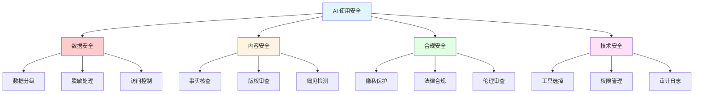
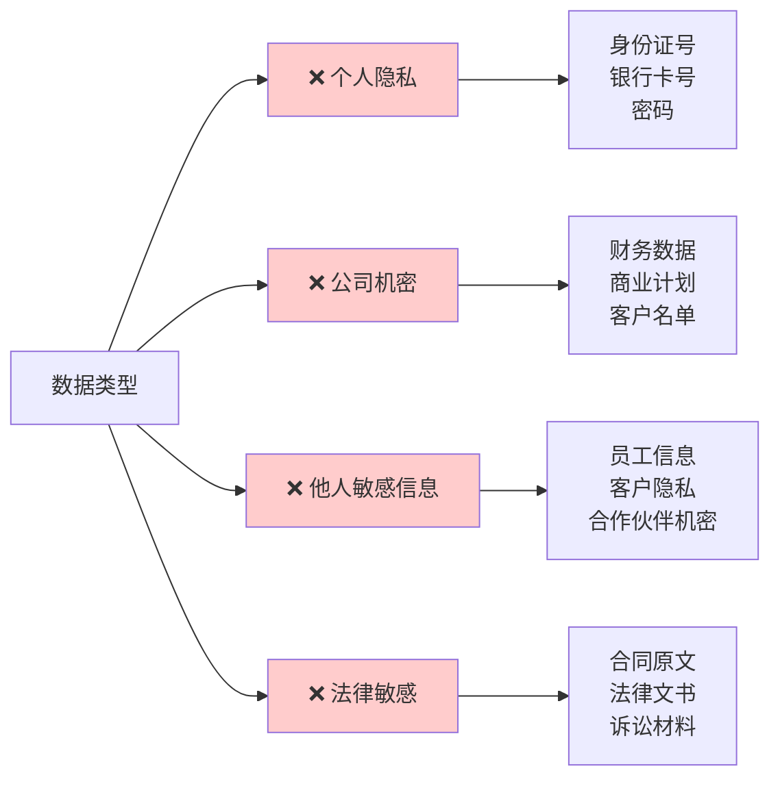
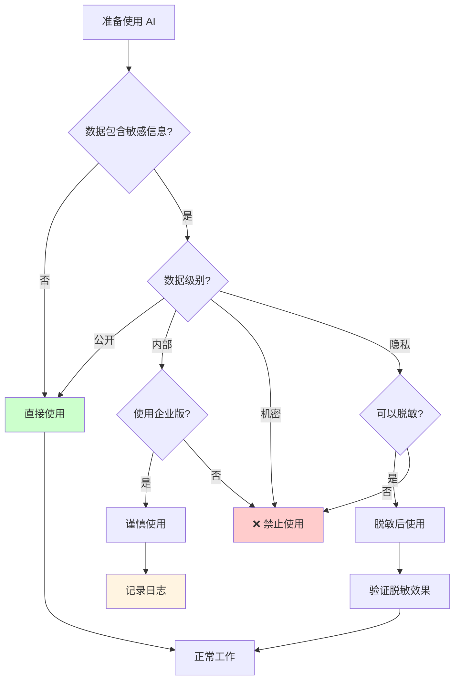

# 第 7 课：AI 协作与安全 - 负责任地使用 AI

> **课程时长**: 2小时 | **难度**: 进阶 | **风格**: 实用指南

---

## 📋 本课概览

### 🎯 核心观点

使用 AI 不仅要追求效率，更要注重：
- 数据安全和隐私保护
- 内容真实性和版权
- 团队协作规范
- 伦理和社会责任

### 📚 你将学到

- AI 使用的安全红线
- 如何识别和避免 AI 风险
- 团队 AI 协作最佳实践
- AI 伦理和合规要求

### 🎁 你将带走

- AI 使用安全检查清单
- 团队 AI 使用规范模板
- 风险识别和应对指南

---

## 📖 课程内容

### 1. 数据安全与隐私

**AI 使用安全框架**：



#### 绝对不能输入 AI 的信息

**数据安全红线清单**：



**红线清单**：

```
❌ 个人隐私信息
- 身份证号、护照号
- 银行卡号、密码
- 家庭住址、电话号码

❌ 公司机密信息
- 未公开的财务数据
- 商业计划和战略
- 客户名单和联系方式
- 源代码（除非使用企业版）

❌ 他人敏感信息
- 员工个人信息
- 客户隐私数据
- 合作伙伴机密

❌ 法律敏感信息
- 合同原文
- 法律文书
- 诉讼材料
```

#### 安全使用原则

**数据安全决策流程**：



**脱敏处理**：

```
❌ 错误示例：
"帮我分析张三（身份证：110101199001011234）的信用情况"

✅ 正确示例：
"帮我分析一个用户（年龄 30 岁，月收入 2 万）的信用情况"
```

**数据分级**：

| 级别 | 数据类型 | 是否可用 AI | 注意事项 |
|------|----------|-------------|----------|
| 公开 | 已发布的内容 | ✅ 可以 | 无限制 |
| 内部 | 团队文档 | ⚠️ 谨慎 | 使用企业版 |
| 机密 | 商业机密 | ❌ 禁止 | 绝对不可 |
| 隐私 | 个人信息 | ❌ 禁止 | 必须脱敏 |

### 2. 内容真实性与版权

#### AI 生成内容的风险

**事实性错误**：

```
AI 可能：
- 编造不存在的数据
- 引用虚假的来源
- 混淆时间和因果关系
- 给出过时的信息
```

**检查方法**：

```
✅ 核实所有数据来源
✅ 交叉验证关键信息
✅ 查证引用和案例
✅ 确认时效性
```

#### 版权问题

**AI 生成内容的版权归属**：

```
目前法律尚不明确，建议：
- 不要直接声称 AI 生成内容的版权
- 对 AI 生成内容进行实质性修改
- 在商业使用前咨询法务
- 标注"AI 辅助创作"
```

**使用 AI 时的版权风险**：

```
❌ 让 AI 模仿特定作者风格（可能侵权）
❌ 让 AI 续写受版权保护的作品
❌ 用 AI 生成与知名品牌相似的内容
```

### 3. 团队协作规范

#### 制定团队 AI 使用规范

**规范模板**：

```markdown
# 团队 AI 使用规范

## 1. 适用范围
- 适用于所有使用 AI 工具的场景
- 包括但不限于：ChatGPT、Claude、文心一言等

## 2. 安全红线
- 禁止输入客户隐私信息
- 禁止输入公司商业机密
- 禁止输入未公开的财务数据

## 3. 使用场景
允许使用：
- 文档撰写辅助
- 数据分析（脱敏后）
- 代码辅助（非核心代码）

需要审批：
- 对外内容生成
- 涉及客户的分析

## 4. 质量把控
- AI 生成内容必须人工审核
- 关键数据必须交叉验证
- 对外内容需要二次确认

## 5. 工具选择
推荐工具：
- 企业版 ChatGPT（已购买）
- 飞书 AI（内部文档）

禁止工具：
- 未经审批的第三方工具
```

#### 知识共享机制

**建立团队提示词库**：

```
1. 创建共享文档（Notion/飞书）
2. 按场景分类整理提示词
3. 标注适用岗位和场景
4. 定期更新和优化
5. 鼓励团队成员贡献
```

### 4. AI 伦理与社会责任

#### 避免偏见和歧视

**AI 可能存在的偏见**：

```
- 性别偏见（如：程序员默认为男性）
- 种族偏见
- 年龄偏见
- 地域偏见
```

**如何避免**：

```
✅ 使用中性语言
✅ 明确要求 AI 避免刻板印象
✅ 人工审核敏感内容
✅ 多样化测试场景
```

#### 负责任的 AI 使用

**原则**：

```
1. 透明性
   - 明确告知内容由 AI 辅助生成
   - 不隐瞒 AI 的使用

2. 可控性
   - 保持人类的最终决策权
   - 不盲目依赖 AI 输出

3. 公平性
   - 确保 AI 不歧视任何群体
   - 关注弱势群体的权益

4. 可追溯性
   - 记录 AI 使用过程
   - 保留关键决策依据
```

---

## 💡 岗位专属安全指南

### 产品经理

**安全要点**：
- ❌ 不要输入未公开的产品规划
- ❌ 不要输入真实的用户数据
- ✅ 使用虚拟数据进行分析
- ✅ PRD 发布前人工审核

### 运营

**安全要点**：
- ❌ 不要输入真实的用户画像
- ❌ 不要输入未公开的活动数据
- ✅ 对外内容必须二次确认
- ✅ 数据分析使用脱敏数据

### HR

**安全要点**：
- ❌ 不要输入候选人简历原文
- ❌ 不要输入员工个人信息
- ✅ 使用匿名化数据
- ✅ 招聘 JD 发布前人工审核

---

## 🎯 实战练习

### 练习 1：风险识别

判断以下场景是否安全：

```
场景 1：用 AI 分析公司去年的销售数据
场景 2：让 AI 帮忙写一封给客户的邮件（包含客户姓名）
场景 3：用 AI 生成一篇公众号文章
场景 4：让 AI 分析竞品的公开财报
```

### 练习 2：制定团队规范

为你的团队制定一份 AI 使用规范，包含：
1. 安全红线
2. 适用场景
3. 质量把控流程

---

## ⚠️ 常见风险案例

### 案例 1：数据泄露

**事件**：某公司员工将客户名单输入 ChatGPT 进行分析，导致数据泄露风险。

**教训**：
- 使用脱敏数据
- 使用企业版工具
- 建立审批流程

### 案例 2：版权纠纷

**事件**：某公司使用 AI 生成的图片用于商业宣传，被指侵权。

**教训**：
- 商业使用前咨询法务
- 对 AI 生成内容进行修改
- 购买商业授权

### 案例 3：事实性错误

**事件**：某媒体直接发布 AI 生成的新闻，包含多处事实错误。

**教训**：
- 所有事实必须核实
- 建立审核流程
- 保留人工把关环节

---

## 📚 延伸阅读

- [AI 伦理指南](https://example.com)
- [数据安全最佳实践](https://example.com)
- [AI 版权法律解读](https://example.com)

---

## ❓ 常见问题

**Q: 使用企业版 AI 工具就安全了吗？**

A: 企业版提供更好的数据保护，但仍需遵守安全规范。机密信息依然不应输入。

**Q: AI 生成的内容可以直接对外发布吗？**

A: 不建议。必须经过人工审核，确保事实准确、无版权问题、符合品牌调性。

**Q: 如何判断信息是否可以输入 AI？**

A: 问自己：这个信息如果被公开，会有什么后果？如果后果严重，就不要输入。

---

## 🎓 课程总结

通过本课程，你应该：

✅ 建立了 AI 使用的安全意识
✅ 掌握了数据脱敏的方法
✅ 了解了版权和伦理问题
✅ 能够制定团队使用规范

**记住**：AI 是工具，责任在人。负责任地使用 AI，才能长期受益。
