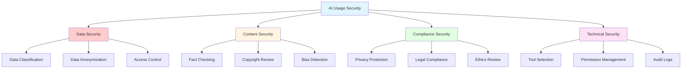
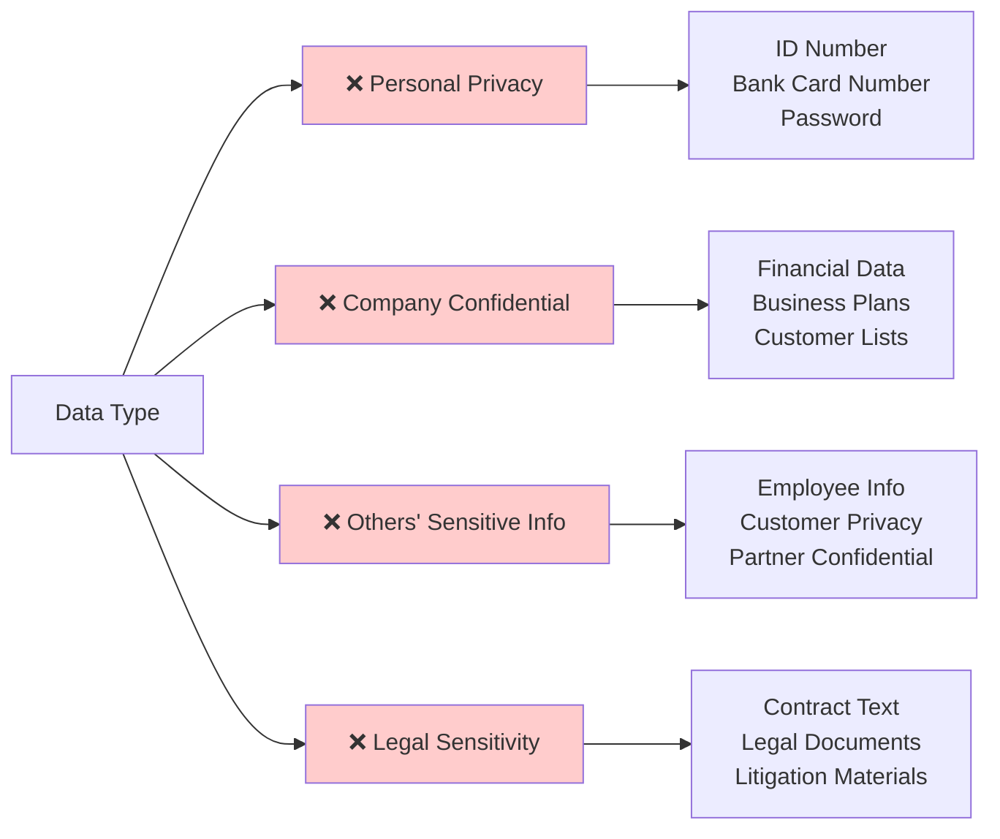
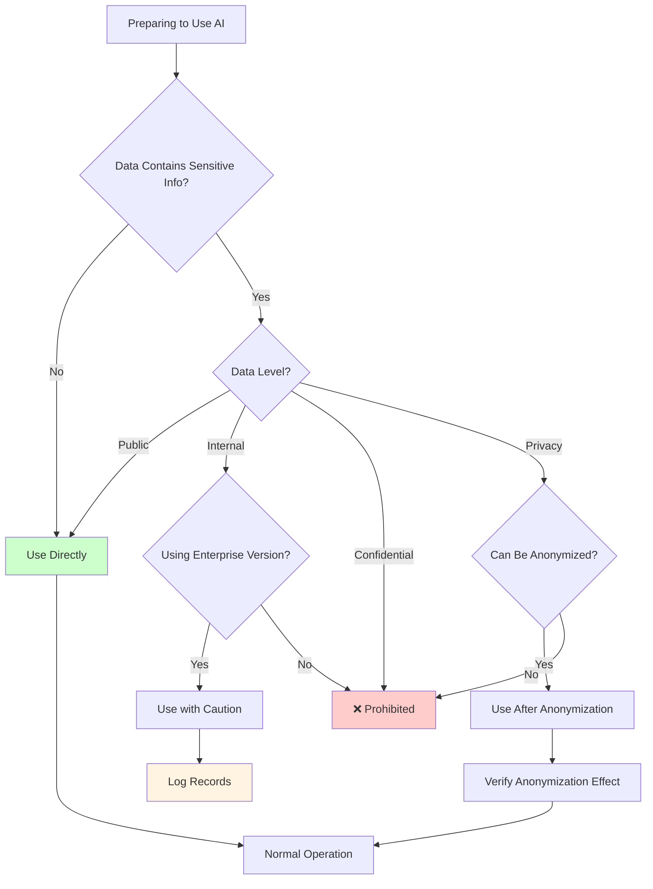

# Lesson 7: AI Collaboration and Security - Using AI Responsibly

> **Duration**: 2 hours | **Level**: Advanced | **Style**: Practical Guide

---

## 📋 Lesson Overview

### 🎯 Core Concepts

Using AI is not just about efficiency, but also about:
- Data security and privacy protection
- Content authenticity and copyright
- Team collaboration standards
- Ethics and social responsibility

### 📚 You Will Learn

- Security boundaries for AI usage
- How to identify and avoid AI risks
- Best practices for team AI collaboration
- AI ethics and compliance requirements

### 🎁 You Will Take Away

- AI usage security checklist
- Team AI usage policy template
- Risk identification and response guide

---

## 📖 Lesson Content

### 1. Data Security and Privacy

**AI Usage Security Framework**:



#### Information That Must Never Be Input to AI

**Data Security Red Line Checklist**:



**Red Line Checklist**:

```
❌ Personal Privacy Information
- ID card number, passport number
- Bank card number, password
- Home address, phone number

❌ Company Confidential Information
- Unpublished financial data
- Business plans and strategies
- Customer lists and contact information
- Source code (unless using enterprise version)

❌ Others' Sensitive Information
- Employee personal information
- Customer privacy data
- Partner confidential information

❌ Legal Sensitive Information
- Contract text
- Legal documents
- Litigation materials
```

#### Security Usage Principles

**Data Security Decision Flow**:



**Data Anonymization**:

```
❌ Wrong Example:
"Help me analyze Zhang San's (ID: 110101199001011234) credit situation"

✅ Correct Example:
"Help me analyze a user's (age 30, monthly income 20k) credit situation"
```

**Data Classification**:

| Level | Data Type | AI Usable | Notes |
|------|----------|-------------|----------|
| Public | Published content | ✅ Yes | No restrictions |
| Internal | Team documents | ⚠️ With caution | Use enterprise version |
| Confidential | Trade secrets | ❌ Prohibited | Absolutely not |
| Privacy | Personal information | ❌ Prohibited | Must anonymize |

### 2. Content Authenticity and Copyright

#### Risks of AI-Generated Content

**Factual Errors**:

```
AI may:
- Fabricate non-existent data
- Cite fake sources
- Confuse timelines and causality
- Provide outdated information
```

**Verification Methods**:

```
✅ Verify all data sources
✅ Cross-validate key information
✅ Verify citations and cases
✅ Confirm timeliness
```

#### Copyright Issues

**Copyright Ownership of AI-Generated Content**:

```
Current law is unclear, recommendations:
- Do not directly claim copyright on AI-generated content
- Make substantial modifications to AI-generated content
- Consult legal department before commercial use
- Label as "AI-assisted creation"
```

**Copyright Risks When Using AI**:

```
❌ Having AI imitate a specific author's style (may infringe)
❌ Having AI continue copyrighted works
❌ Using AI to generate content similar to well-known brands
```

### 3. Team Collaboration Standards

#### Establishing Team AI Usage Guidelines

**Policy Template**:

```markdown
# Team AI Usage Policy

## 1. Scope
- Applies to all scenarios using AI tools
- Including but not limited to: ChatGPT, Claude, Ernie Bot, etc.

## 2. Security Red Lines
- Prohibited from inputting customer privacy information
- Prohibited from inputting company trade secrets
- Prohibited from inputting unpublished financial data

## 3. Usage Scenarios
Allowed:
- Document writing assistance
- Data analysis (after anonymization)
- Code assistance (non-core code)

Requires approval:
- External content generation
- Analysis involving customers

## 4. Quality Control
- AI-generated content must be manually reviewed
- Key data must be cross-validated
- External content requires secondary confirmation

## 5. Tool Selection
Recommended tools:
- Enterprise ChatGPT (purchased)
- Feishu AI (internal documents)

Prohibited tools:
- Unapproved third-party tools
```

#### Knowledge Sharing Mechanism

**Building a Team Prompt Library**:

```
1. Create a shared document (Notion/Feishu)
2. Organize prompts by scenario
3. Label applicable positions and scenarios
4. Regularly update and optimize
5. Encourage team member contributions
```

### 4. AI Ethics and Social Responsibility

#### Avoiding Bias and Discrimination

**Potential AI Biases**:

```
- Gender bias (e.g., programmer assumed to be male)
- Racial bias
- Age bias
- Regional bias
```

**How to Avoid**:

```
✅ Use neutral language
✅ Explicitly ask AI to avoid stereotypes
✅ Manually review sensitive content
✅ Test diverse scenarios
```

#### Responsible AI Usage

**Principles**:

```
1. Transparency
   - Clearly state content is AI-assisted
   - Do not hide AI usage

2. Controllability
   - Maintain human final decision authority
   - Do not blindly rely on AI output

3. Fairness
   - Ensure AI does not discriminate against any group
   - Pay attention to the interests of vulnerable groups

4. Traceability
   - Record AI usage process
   - Preserve key decision basis
```

---

## 💡 Role-Specific Security Guidelines

### Product Manager

**Security Points**:
- ❌ Do not input unpublished product plans
- ❌ Do not input real user data
- ✅ Use dummy data for analysis
- ✅ Manually review PRD before release

### Operations

**Security Points**:
- ❌ Do not input real user profiles
- ❌ Do not input unpublished campaign data
- ✅ External content must be double-checked
- ✅ Use anonymized data for analysis

### HR

**Security Points**:
- ❌ Do not input candidate resume text
- ❌ Do not input employee personal information
- ✅ Use anonymized data
- ✅ Manually review job postings before release

---

## 🎯 Practical Exercises

### Exercise 1: Risk Identification

Determine whether the following scenarios are safe:

```
Scenario 1: Using AI to analyze the company's sales data from last year
Scenario 2: Having AI help write an email to a customer (including customer name)
Scenario 3: Using AI to generate a WeChat public account article
Scenario 4: Having AI analyze a competitor's public financial report
```

### Exercise 2: Establishing Team Guidelines

Create an AI usage policy for your team, including:
1. Security red lines
2. Applicable scenarios
3. Quality control processes

---

## ⚠️ Common Risk Cases

### Case 1: Data Breach

**Incident**: An employee at a company input a customer list into ChatGPT for analysis, creating a data breach risk.

**Lessons**:
- Use anonymized data
- Use enterprise version tools
- Establish approval processes

### Case 2: Copyright Dispute

**Incident**: A company used AI-generated images for commercial promotion and was accused of infringement.

**Lessons**:
- Consult legal department before commercial use
- Modify AI-generated content
- Purchase commercial license

### Case 3: Factual Errors

**Incident**: A media outlet directly published AI-generated news containing multiple factual errors.

**Lessons**:
- All facts must be verified
- Establish review processes
- Maintain human oversight

---

## 📚 Further Reading

- [AI Ethics Guidelines](https://example.com)
- [Data Security Best Practices](https://example.com)
- [AI Copyright Legal Interpretation](https://example.com)

---

## ❓ Frequently Asked Questions

**Q: Is it safe to use enterprise AI tools?**

A: Enterprise versions provide better data protection, but security guidelines must still be followed. Confidential information should still not be entered.

**Q: Can AI-generated content be published directly?**

A: Not recommended. It must go through manual review to ensure factual accuracy, no copyright issues, and alignment with brand voice.

**Q: How to determine if information can be input to AI?**

A: Ask yourself: What would be the consequences if this information were made public? If the consequences are serious, do not enter it.

---

## 🎓 Lesson Summary

Through this lesson, you should:

✅ Have established security awareness for AI usage
✅ Have mastered data anonymization methods
✅ Have understood copyright and ethics issues
✅ Be able to establish team usage guidelines

**Remember**: AI is a tool, responsibility lies with humans. Only by using AI responsibly can you benefit long-term.
